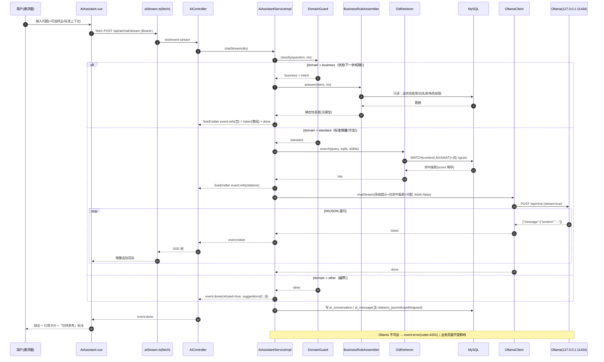
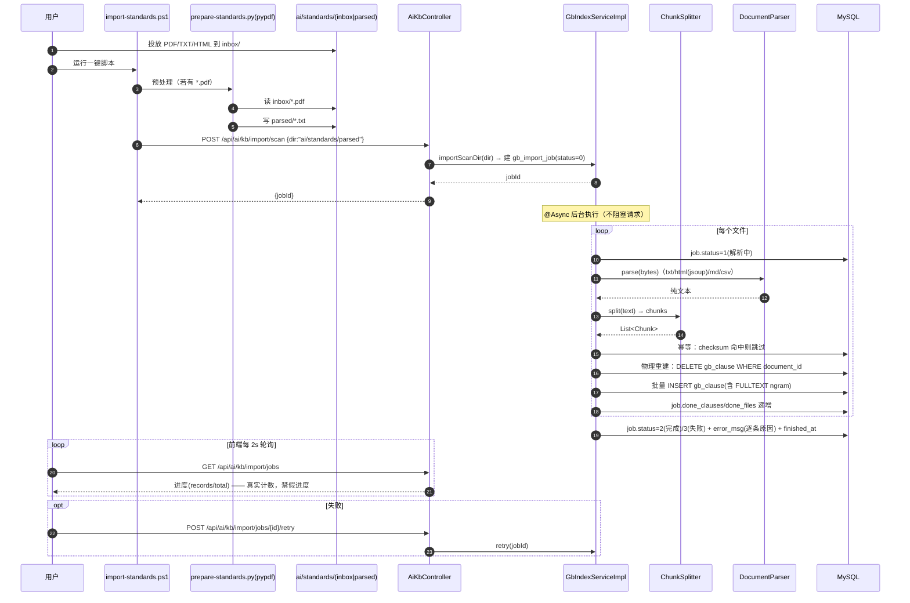
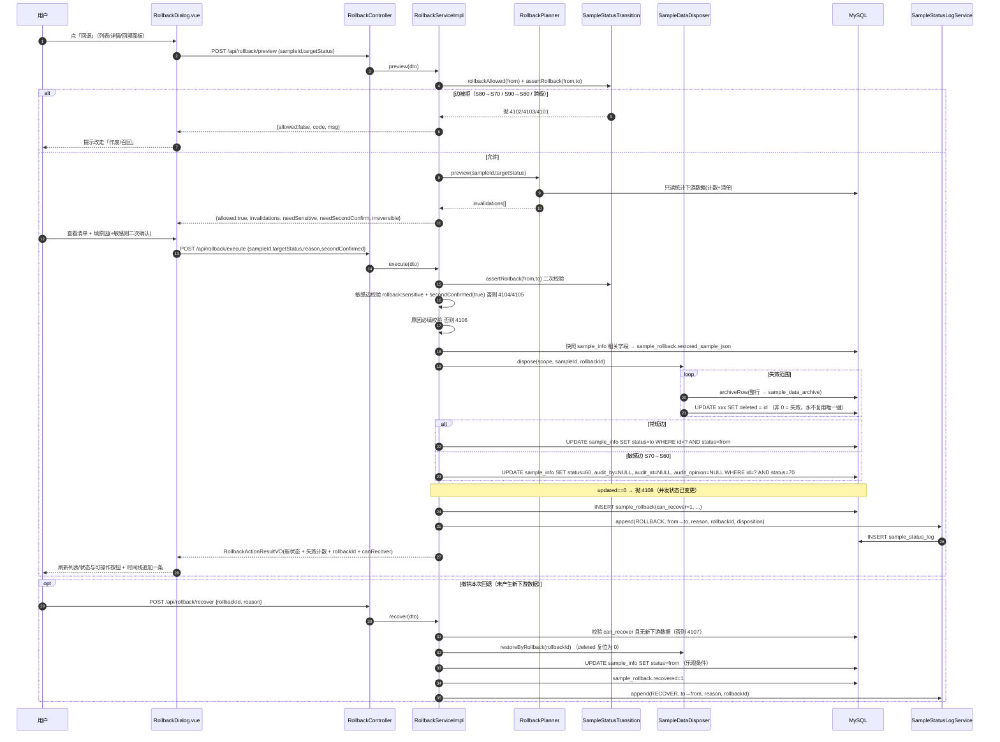
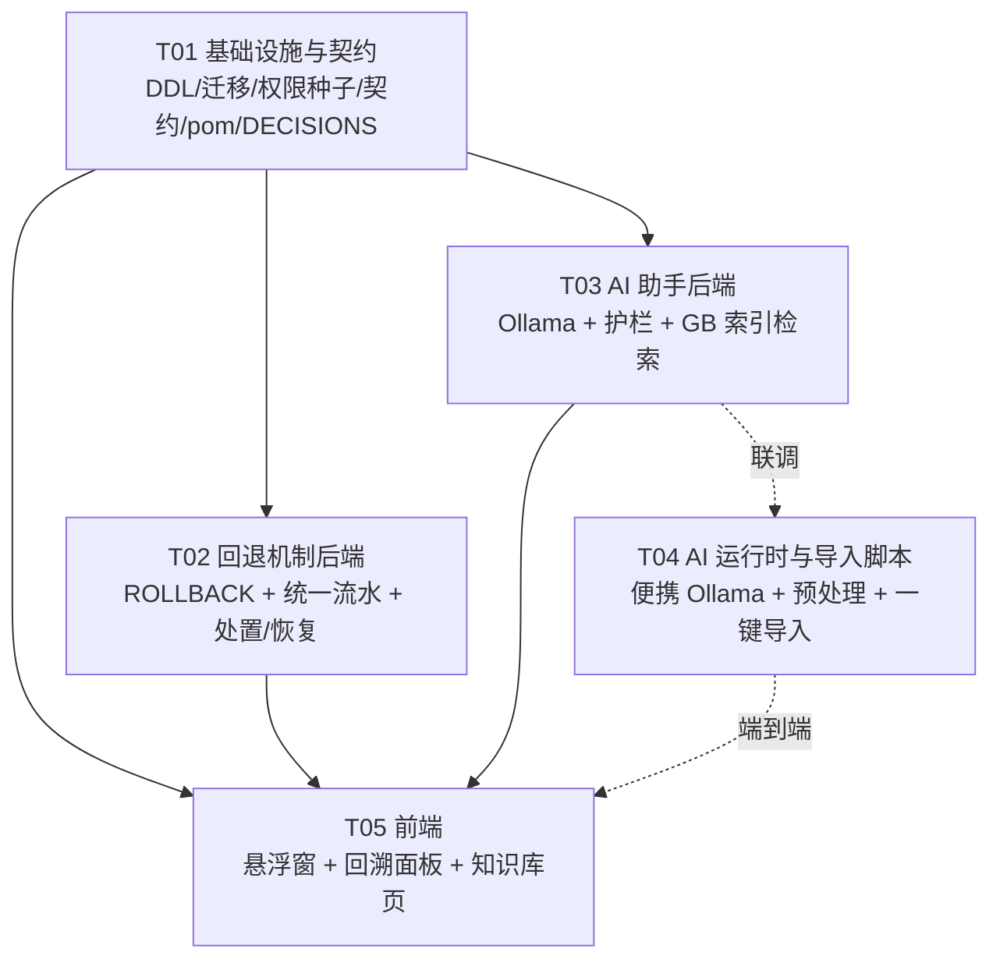

# 架构设计与任务分解：本地 AI 助手 + 全流程逐步回退

> 交付物类型：**系统设计 + 任务分解**（架构师高见远，2026-09-17）
> 对应 PRD：`docs/design/2026-09-17-prd-ai-assistant-and-rollback.md`（产品层裁决 T1~T6，本设计**服从**）
> 增量代号：`ai_assistant_and_rollback`
> 本文件是**唯一允许写出的代码级交付物**（架构师只出设计，不写实现）。所有 SQL/契约/文件清单/类与方法名均已写实到可直接施工。

---

## 0. 设计约束复核（先说清"不能碰什么"）

| 约束 | 来源 | 本设计如何遵守 |
|---|---|---|
| 判定唯一权威 `JudgeEngine`，AI 绝不写业务结论字段 | PRD T3 红线 | AI 服务层**不持有** `JudgeEngine`、**不持有**任何样品业务表的写 Mapper；仅经只读 `BusinessContextReader` 读状态 |
| 正向/逆向白名单不得合并 | `SampleStatusTransition` 类注释 + AGENTS 7.2 | 新增**第三条**独立白名单 `ROLLBACK`（独立断言），`VALID`/`RETURN` 一字不动 |
| 审计流水只增不改、无物理删除路径 | PRD G5 / B-06 | 业务数据一律「失效 + 留档」；`sample_status_log`/`sample_audit_log` 无 UPDATE/DELETE 入口 |
| 乐观条件 UPDATE（`WHERE id=? AND status=旧值`） | 既有 9 处流转 | 回退同样用乐观条件 UPDATE，`updated==0` → 业务码 4108 |
| 审计四字段自动填充 | `AuditMetaObjectHandler` | 新实体继承 `BaseEntity`，业务代码不手工赋值 |
| 统一响应 `{code,msg,data}`、新域分页 `current/size` | api-spec 0.2/0.3 | 所有新接口沿用 |
| 禁止 mock 假数据、UI 令牌化、契约先行 | AGENTS 1 / 5.1 | AI 状态/进度/命中全部真实；UI 只用 `--lims-*`；新接口先落 `api-spec.md` |
| 零新增 Maven 依赖优先 | 离线 `.m2` 现实 | **仅新增 jsoup 1.18.3**（`.m2` 实体已存在，实测见 §8）；PDF 走 Python 预处理 |

---

## 1. 设计概览

### 1.1 ASCII 架构图

```
                              ┌──────────────────────────────────────────────┐
                              │           浏览器（Vue3 + Element Plus）        │
                              │                                              │
   ┌───────────────┐          │  MainLayout.vue（外壳，唯一全局悬浮容器宿主）   │
   │ 既有 17 个页面 │◄────────►│    ├─ <router-view>  …… 既有业务页面（不动）   │
   │（业务主线不动）│          │    └─ <AiAssistant>  ← 新增：右下角悬浮窗       │
   └───────────────┘          │         · 三态：收起/展开/会话                  │
                              │         · 拖拽 + localStorage 位置记忆          │
                              │         · 引用卡片渲染（无 Markdown 依赖）      │
                              │  stores/aiAssistant.ts（开合/位置/上下文联动）  │
                              │  RollbackDialog / RollbackTimeline（回退/回溯） │
                              └───────────────┬──────────────────────────────┘
                                              │ HTTPS 同源 /api（JWT）
                    ┌─────────────────────────┴──────────────────────────┐
                    │        Spring Boot 3.3.2（server.context-path=/api）  │
                    │                                                      │
   ┌────────────────┴─────────────────┐        ┌───────────────────────────┴────┐
   │ 【特性 B】/api/rollback  /report/void│        │ 【特性 A】/api/ai（纯旁路）        │
   │  RollbackController               │        │  AiController  /  AiKbController │
   │  ReportVoidController             │        │  ─────────────────────────────── │
   │        │                          │        │  DomainGuard（本地规则护栏）       │
   │  RollbackService ─ RollbackPlanner│        │  BusinessRuleAssembler（确定性装配）│
   │        │            │             │        │  GbRetriever（ngram 检索）         │
   │  SampleDataDisposer（失效/留档/恢复）│        │  GbIndexService（异步导入建索引）   │
   │        │                          │        │  OllamaClient（JDK17 HttpClient）  │
   │  SampleStatusLogService（统一流水） │        │  OllamaHealthChecker（健康检查）   │
   │  SampleStatusTransition(+ROLLBACK) │        │        │  NDJSON 流             │
   └────────┴──────────────────────────┘        └────────┼──────────────────────────┘
            │  ①乐观条件 UPDATE ②逻辑失效(留档) ③追加流水    │ 127.0.0.1:11434
            ▼                                            ▼
   ┌────────────────────────────────────┐      ┌──────────────────────────────┐
   │            MySQL 8.0.45            │      │  Ollama（仓库内便携运行时）      │
   │  既有：sample_info/sample_item/     │      │   ai/runtime/ollama.exe        │
   │        sample_result/sample_audit_log│     │   ai/models/  (OLLAMA_MODELS)  │
   │  新增：sample_status_log            │      │   qwen3:4b-instruct（think=false）│
   │        sample_rollback             │      │   ← 零外发，仅回环口            │
   │        sample_data_archive         │      └──────────────────────────────┘
   │        report_void                 │
   │        gb_document/gb_clause(FULLTEXT ngram)/gb_import_job
   │        ai_conversation/ai_message  │      ┌──────────────────────────────┐
   └────────────────────────────────────┘      │  ai/standards/  GB 原始文件     │
                                               │   inbox/(投放) parsed/(解析产物) │
                                               │   ← python prepare-standards.py │
                                               └──────────────────────────────┘
```

### 1.2 一段话：两组能力如何与既有系统解耦

**特性 B（回退）是"嵌入式增强"**：它不新建业务表、不改判定引擎、不动报告实时聚合，只做三件事——① 在 `SampleStatusTransition` 里**追加第三条独立白名单** `ROLLBACK`（`VALID`/`RETURN` 零改动）；② 新增一张**统一状态流水表** `sample_status_log`，把既有 9 处流转 + 新增回退边全部记成"从哪到哪"的追加型事件（`sample_audit_log` 口径兼容、不改写）；③ 新增 `SampleDataDisposer` 统一承接"下游数据失效/留档/恢复"，把原先散落在 `saveDecompose` 的**覆盖式重建**和 `upsertResult` 的**覆盖式 upsert**收敛到一个可逆的处置器里。业务页面的读路径（`deleted=0` 过滤）**完全不变**，因此回归面被压到最小。

**特性 A（AI 助手）是"纯旁路"**：它只新增 `ai_*` / `gb_*` 表，只新增 `/api/ai/**` 接口，前端只在外壳 `MainLayout` 挂一个悬浮组件。**它对业务表只有只读依赖，没有任何写路径**；Ollama 是仓库内独立进程，后端经 JDK17 内置 `HttpClient` 走回环口调用，**零外发**。Ollama 未启动时，AI 接口返回可读的业务码，业务页面照常工作（旁路隔离由"独立控制器 + 独立异常码 + 前端静默降级"三重保证）。

---

## 2. 技术选型与裁决（逐主题：选定 / 排除 / 理由 / 反例）

### 2.1 模型运行时与部署方式

- **选定**：**Ollama 便携版，全量落在仓库内 `ai/runtime/`**；模型权重经 `OLLAMA_MODELS` 指向 `ai/models/`；脚本 `ai/scripts/*.ps1` 负责安装/拉起/自检。模型 **`qwen3:4b-instruct`**（非思考变体，2.5GB Q4_K_M），API 同时传 `"think": false` 双保险。
- **排除的备选**：
  1. *用户主目录默认安装（`%LOCALAPPDATA%\Programs\Ollama` + `~/.ollama`）* —— 直接违反 A-01「整体搬走仓库目录后助手仍可用、不依赖用户主目录」。
  2. *`qwen3:4b`（默认思考模式）* —— 会输出 ` thinking...\n`，既污染悬浮窗展示，又显著抬高延迟（CPU 1~5 tok/s 下思考内容会翻倍等待）。`-instruct` + `think:false` 是交互式助手的正确形态。
  3. *Docker 化托管 Ollama* —— 权重仍会落到 Docker 卷（仓库外），且沙箱无法保证 Docker 可用；违反"可整体搬走"。
  4. *llama.cpp / vLLM 自编译* —— 需要工具链与额外运行时，收益为负。
- **下载通道（沙箱实测硬边界）**：GitHub Release 直链 502；`https://ghfast.top/<原URL>`、`https://gh-proxy.com/<原URL>` 可连通；ModelScope / hf-mirror 可访问。→ 脚本内置**多镜像候选 + 逐个回退 + 手动下载兜底说明**，任一通道成功即停。

### 2.2 后端调用方式

- **选定**：**JDK17 自带 `java.net.http.HttpClient`** 直连 `POST http://127.0.0.1:11434/api/chat`。**零新增 Maven 依赖**。
- **排除**：
  1. *spring-ai 1.0.0-M6*（`.m2` 确有）—— 里程碑版本、与 Boot 3.3.2 兼容性未验证、离线仓可能缺传递依赖、且会强行引入 ChatClient/Embedding 抽象与自动配置（可能干扰既有 `WebConfig`/Spring Security）。**反例**：我们用到的只是"POST 一个 JSON 拿 NDJSON 流"，`HttpClient` 20 行即可完成，引入一整套 AI 抽象框架是"用大炮打蚊子"且引入版本风险。
  2. *OkHttp / Apache HttpClient* —— 非 JDK 内置，须新增依赖，`.m2` 未确认存在，无收益。

### 2.3 流式输出方式

- **选定**：后端 **Spring MVC `SseEmitter`**（`spring-webmvc` 已在依赖内）读取 Ollama 的 **NDJSON 流**并**转封装为 SSE 事件**下发；前端用**原生 `fetch()` + `ReadableStream`** 解析 `text/event-stream`。
- **排除**：
  1. *WebFlux* —— 必须替换整个 Web 栈（与既有 MVC + `HandlerInterceptor` + `@PreAuthorize` 冲突），成本不可接受。
  2. *前端 `EventSource`* —— **无法设置 `Authorization` 头**（无法带 JWT）；而本项目鉴权全靠 `Authorization: Bearer`。用 query 传 token 又违反「禁止 Token 入 URL」。→ 必须用 `fetch` 流式读取（原生支持自定义头）。
  3. *非流式一次性返回* —— CPU 推理 1~5 tok/s，一条 200 token 的回答要等 40~200s，用户会以为"卡死"。**流式是可用性前提，不是优化项**。
- **失败降级**：`POST /api/ai/chat`（非流式）保留为等价接口，供自检、单测与流式通道异常时前端自动回退调用。

### 2.4 GB 索引与检索方案

- **选定（实测支撑）**：**MySQL 8.0.45 `FULLTEXT ... WITH PARSER ngram` 全文索引**（实测 `ngram_token_size=2`、`innodb_ft_min_token_size=3`、`ngram` 插件 ACTIVE）。检索走 `MATCH(content) AGAINST(? IN BOOLEAN MODE)`，只查倒排索引，**绝不全量读文件**。
- **切块策略**：`ChunkSplitter` 按"条款标题/编号/分页"切块，目标 **200~500 字/块**（`gb_clause.content` 为 `TEXT`），块小 → 单行小 → 检索命中后取正文的内存与网络开销都受控。
- **查询构造**：把用户问题做中文分词（2-gram 切分），**默认 AND 语义**（每个 ≥2 字的词包成 `+词`），命中为 0 时**自动降级为 OR 语义**；可选短语精确用 `"词"`。排序取 `MATCH() AGAINST(...) AS score` 降序取 top-N（默认 N=5）。
- **排除**：
  1. *Apache Lucene* —— `.m2` **无**，离线拉不到，直接排除。
  2. *`LIKE '%词%'` 全表扫描* —— ≥1GB 时必超 2s，且内存随扫描线性增长，直接违反 G1。
  3. *应用层自建倒排（内存 Map）* —— 1GB 文本的内存倒排会线性占用堆内存（违反"检索期内存不随库体积线性增长"），且重启即丢。
  4. *把标准文件整篇塞进模型上下文做"长上下文 RAG"* —— qwen3:4b 实用窗口按 32K 算，1GB 库根本塞不下；且延迟不可接受。
- **ngram 已知行为（必须写进实现注释，防踩坑）**：
  - 单字查询（如只问"铅"）会被 ngram 忽略（token 长度 = `ngram_token_size` = 2）；检索词需 ≥2 字，**单字查询由 `GbRetriever` 自动补足为常见 2 字组合或提示补充关键词**。
  - `innodb_ft_min_token_size`（=3）对 ngram 解析器**不生效**，最小值由 `ngram_token_size` 决定 —— 不要据此误判"3 字以下搜不到"。
  - `MATCH(...)` 的列清单必须与 FULLTEXT 索引列**完全一致**，否则报 1191。
  - Boolean 模式 `+词` = 必须包含；`"词 词"` = 相邻短语。**默认 `+`，0 命中再降级为 OR**。
  - 索引重建（`DELETE`+批量 `INSERT`）后建议 `OPTIMIZE TABLE` 合并索引，减少碎片。

### 2.5 PDF 解析方案（必须正面裁决）

- **选定：① Java 侧原生解析 TXT / HTML / MD / CSV（HTML 用 jsoup）；② PDF 由仓库内 Python 预处理脚本 `ai/scripts/prepare-standards.py`（`pypdf`）离线转 `.txt`；③ 一键脚本 `import-standards.ps1` 把二者串成一条用户视角的流水线（投文件 → 跑一条命令 → 后台建索引）。**
- **排除的备选与理由**：
  1. *Maven 拉 PDFBox* —— 实测 `.m2` **无 `org.apache.pdfbox`**，离线仓无法获取 → **不可行**（已用 `find` 核实）。
  2. *只收 TXT/HTML、完全不支持 PDF* —— A-04 明确要求 `PDF/TXT/HTML`，砍掉 PDF 等于需求未交付 → 排除。
  3. *后端直接吞 PDF*（引入 Tika/PDFBox 之类）—— 依赖与 ① 同因不可行；且 Tika 在 `.m2` 也无。
  4. *`pdftotext`（poppler）本地二进制* —— 本机无该可执行文件，且新增原生二进制比 `pip install pypdf` 更重、更难"整体搬走"。
  5. *Python 全包（含 TXT/HTML 也交给 Python）* —— 会让 TXT/HTML 解析绕开已在 `.m2` 的 jsoup，增加"两套解析实现"的漂移风险；且导入通道在后端，口径应统一在后端。
- **fail-loud**：后端导入接口**不接受 `.pdf`**；收到 PDF 时返回业务码 4211 + 文案「PDF 需先经 `ai/scripts/prepare-standards.py` 转为文本（见 ai/README.md）」，**绝不静默丢弃**。
- **版权与体积**：不内置 GB 正文；`ai/standards/**` 原始文件与解析产物**不入库**（见 §7 `.gitignore`）。

### 2.6 回答结构化方案（前端零 Markdown 依赖）

- **选定**：后端返回**结构化回答对象**（见 §4.1 `AiAnswerVO`），前端用**引用卡片**组件渲染；**不引入 Markdown 库**。
- **排除**：
  1. *引入 `markdown-it` / `marked`* —— 增加主包体积（客户端渲染库 ~30~90KB min）、引入 XSS 面（需再引 sanitizer）。PRD Out-of-Scope 已条件性排除。
  2. *后端返回 Markdown 字符串让前端 `v-html`* —— 直接违反 XSS 安全红线，且若渲染则仍需渲染库。
  3. *纯文本无结构* —— 无法天然满足 G3「100% 带标准号 + 出处」与 T3「UI 必须显式区分 AI 建议」。结构化对象让"引用卡片 + 仅供参考标注"成为**结构性必然**，而非"靠模型自觉"。
- **前端渲染规则**：`answer` 按 `\n` 拆段落，`citations[]` 渲染为卡片（标准号 / 条款号 / 片段 / 出处文件），整块右下角固定水印「AI 建议，仅供参考；判定以系统规则为准」。

### 2.7 前端悬浮窗实现方式

- **选定**：**自研轻量组件** `components/ai/AiAssistant.vue`，用 **原生 Pointer Events** 做拖拽（`pointerdown/move/up` + `setPointerCapture`），`localStorage`（key=`lims_ai_panel_pos`）做位置记忆，三态用本地 `ref` 状态机（`collapsed | expanded | conversation`）。
- **排除**：
  1. *引入 `vuedraggable` / `interact.js` / `vue-draggable-resizable`* —— 仅为"把一个固定定位元素拖动"引入完整拖拽库，体积/维护收益为负；边界吸附逻辑 20 行即可。
  2 *改用 `el-drawer` 承载* —— 与"可拖到任意位置 + 位置记忆"的产品诉求冲突（抽屉是固定侧滑）；且抽屉遮罩会挡住业务操作区。
- **与既有风格一致**：位置层级用 `--lims-z-overlay:3000`；表面用 `--lims-layer-elevated` + `--lims-shadow-pop`；圆角 `--lims-r-card`；强调色只做描边/光晕（遵守 AGENTS 5.1 红线）；动效 `--lims-dur*` 且尊重 `prefers-reduced-motion`；**数据密集的会话区用高对比、弱模糊**，不叠加折射玻璃。
- **宿主**：仅改 `MainLayout.vue` 一处挂载 `<AiAssistant/>`（不新增全局容器外的 DOM 层级，不影响既有三区贴合布局）。

### 2.8 回退数据层方案（快照还原 / 反向补偿 / 版本化留档）

- **选定：两层解耦 —— ① 状态层用「反向补偿」；② 数据层用「失效 + 留档（可逆软删 + 归档表）」。合成一句话：状态反向补偿、下游失效留档、留档可恢复。**
- **排除的另两条路**：
  1. *快照还原（Snapshot Restore）* —— 每次破坏性写前整表/整批快照，回退时"整批覆盖回去"。**排除理由**：① 快照会在系统里造出**第二份业务真相**，回退后"快照态 vs 当前态"极易漂移（与项目一贯否决的"两处真相"原则相悖，例如报告不落快照那次的裁决）；② 覆盖式还原本质上要求 UPDATE 回写旧值，破坏"审计流水只增不改"的对称性；③ 存储成本随操作次数增长。**反例**：只有当业务要求"回退必须还原到某个精确历史时间点（时间旅行）"时才值得，而本需求只要"回退到上一状态并处置下游"。
  2. *全量版本化留档（给业务行加 version，读时取 max(version)）* —— **排除理由**：需要给 `sample_item`/`sample_result` 加 `version` 列，并让**所有读路径**（判定引擎、报告聚合、查询、安排、审核）都改成"取当前版本"，回归面覆盖整个业务链；且会与现有唯一键 `(sample_id,item_order,deleted)` / `(sample_item_id,deleted)` 冲突。**反例**：只有当"同一实体需要保留多条并行分支"时才需要，本需求是线性主线。
- **选定方案为什么能同时满足 G5 与 B-07**：失效 = 把 `deleted` 置为非 0（**物理行不消失**）；留档 = 失效前把整行快照写进 `sample_data_archive`（**取证永久可查**）；恢复 = 把留档行对应的原行 `deleted` 复位为 0（**可再撤销**）。三者在同一事务内完成，无中间态。

### 2.9 （新增裁决）**`deleted` 唯一键碰撞** → 失效标记升级为「行自身 id」

- **问题（Pit 1）**：`sample_item` 唯一键 `uk_sample_item_order(sample_id,item_order,deleted)` 只有 `0/1` 两态。`ItemServiceImpl.saveDecompose` 是**覆盖式重建**（先逻辑删除旧明细再全量 INSERT）。当前该路径被 `requireStatus(S20)` 挡住（确认后即 S30，无法二次保存）——**一旦支持回退到 S20，同一批明细被逻辑删除两次就会撞唯一键（1062）**。这是回退机制**新引入**的真实缺陷，必须正面修复。
- **选定**：`sample_item.deleted` / `sample_result.deleted` **列类型由 `TINYINT` 改为 `BIGINT`**；**失效时置为「该行自身 `id`」**（0 仍表示有效）。因每行 id 唯一，`(sample_id,item_order,deleted)` 与 `(sample_item_id,deleted)` **永不可能碰撞**；MP `@TableLogic` 的 select 过滤条件 `deleted = 0` 不受影响（非 0 一律视为已失效）。
- **落点**：所有对这两张表的"逻辑删除"必须改走 `SampleDataDisposer`，**禁止再用 `baseMapper.delete(...)`**（MP 会自动写死 `deleted=1` → 仍会撞键）。
  - ⚠️ **实现修正（2026-09-17 QA 复核后更新）**：本处原写「显式 `LambdaUpdateWrapper.set(Xxx::getDeleted, id)`」，**实测不可行**——
    MyBatis-Plus 会给 `LambdaUpdateWrapper` 的 UPDATE 语句**自动追加 `AND deleted = 0`**（`@TableLogic` 的 select 过滤同样作用于 update 条件），
    于是**匹配不到任何已失效的行**，「失效→恢复」路径直接失效。故最终实现改用**原生 `@Update` 注解 SQL**
    （`UPDATE sample_item SET deleted = id WHERE ...`），**不经过 MP 的逻辑删除拦截**。
    这也是本项目「MP 的 `@TableLogic` 只支持固定字面量、不支持表达式」这一实测结论的第二层后果：
    不仅写不进「行自身 id」，连读侧过滤也会干扰条件更新。
- **附注（QA 复核提出，记档不改）**：`entity/BaseEntity.deleted` 的 Java 类型仍是 `Integer`，而列已改为 `BIGINT`。
  因该字段带 `@TableField(select = false)`（**不参与读取**），当前不存在溢出风险；
  **若将来放开读取该列，必须同步把 Java 类型改为 `Long`**。
- **排除**：*给唯一键额外加 `void_seq` 列* / *改成 `(sample_id,item_order,id)`* —— 都要动唯一键，会让既有数据迁移与所有 upsert 逻辑跟着改，成本大于收益。*物理删除再归档* —— 违反 B-06「无物理删除路径」。

### 2.10 （新增裁决）**GB 索引表允许物理重建**

- **说明**：`gb_document`/`gb_clause` 是**可由原始文件随时重建的派生检索索引**，不是业务留档。换版标准（std_no 相同、内容不同）时，物理 `DELETE` 旧 `gb_clause` 再重建，**不适用**"历史不消失"约束。
- **理由**：若索引也走"失效留档"的软删累积，每换一版标准就无限堆积失效索引行，拖垮 FULLTEXT 检索与体积；而"历史不消失"的立法本意是保护**检验业务证据链**（样品/结果/审核），不保护可再生的检索索引。
- **反例排除**：若审计要求"必须能证明某次回答引用了哪一版标准条款"，由 `ai_message.citations_json` 快照命中片段即可满足，无需保留整个旧索引。

---

## 3. 数据模型

### 3.1 新表（全部遵循 AGENTS 6.1：`id BIGINT AUTO_INCREMENT` / snake_case / 审计四字段 / `deleted` / utf8mb4_general_ci / InnoDB）

#### 3.1.1 `sample_status_log` —— **统一状态流水表（本次核心新增）**

```sql
-- db/init/10_rollback_tables.sql 之一
-- 定位：把「样品状态变更」这件事的所有事件（正向 + 逆向 + 回退 + 恢复 + 作废）收敛成
--       一条可精确回答「谁 / 何时 / 从哪到哪 / 为何 / 入口」的追加型事件流。
-- ⚠️ 本表的诞生**推翻了** DECISIONS 2026-09-13「不新建状态流水表、用既有字段近似推导」的自裁：
--    回退要求「从哪到哪」可精确查询，近似推导已不成立（详见本文件 §10 与 DECISIONS 新增条目）。
-- ⚠️ 只追加、永不改写；无 UPDATE / DELETE 入口。
-- 口径兼容：字段与 sample_audit_log 对齐（from_status/to_status/operated_by/operated_at/reason），
--          audit 域动作**双写**（sample_audit_log 保持不变，报告/打印/既有读路径零改动）。
DROP TABLE IF EXISTS `sample_status_log`;
CREATE TABLE `sample_status_log` (
  `id`                BIGINT       NOT NULL AUTO_INCREMENT COMMENT '主键',
  `sample_id`         BIGINT       NOT NULL COMMENT '样品ID（sample_info.id）',
  `sample_no`         VARCHAR(50)  NOT NULL COMMENT '样品编号（冗余，便于查询）',

  `event_type`        TINYINT      NOT NULL COMMENT '事件类型 1=正向推进 2=审核退回 3=签发 4=回退 5=恢复 6=作废/召回 7=报告生成（见 common/enums/StatusEventType）',
  `from_status`       TINYINT      NOT NULL COMMENT '变更前状态 code',
  `to_status`         TINYINT      NOT NULL COMMENT '变更后状态 code',
  `action_label`      VARCHAR(32)  NOT NULL COMMENT '人类可读动作（如「登记确认」「审核退回」「回退至已安排」）',

  `reason`            VARCHAR(500)          DEFAULT NULL COMMENT '原因（回退/退回/作废必填，正向可空）',
  `rollback_id`       BIGINT                DEFAULT NULL COMMENT '关联 sample_rollback.id（回退/恢复事件）',
  `data_disposition`  VARCHAR(500)          DEFAULT NULL COMMENT '下游数据处置摘要（如「失效 12 项结果、3 项明细」）',
  `source`            VARCHAR(32)           DEFAULT NULL COMMENT '入口/来源：SAMPLE/ITEM/ASSIGN/RESULT/AUDIT/REPORT/ROLLBACK_PANEL',

  `operated_by`       VARCHAR(64)           DEFAULT NULL COMMENT '操作人工号',
  `operated_at`       DATETIME              DEFAULT NULL COMMENT '操作时间',

  `created_by`        VARCHAR(64)           DEFAULT NULL COMMENT '创建人',
  `created_at`        DATETIME              DEFAULT NULL COMMENT '创建时间',
  `updated_by`        VARCHAR(64)           DEFAULT NULL COMMENT '更新人',
  `updated_at`        DATETIME              DEFAULT NULL COMMENT '更新时间',
  `deleted`           TINYINT      NOT NULL DEFAULT 0 COMMENT '逻辑删除 0=否 1=是（业务上不使用删除）',

  PRIMARY KEY (`id`),
  KEY `idx_ssl_sample_id_id` (`sample_id`, `id`),   -- 支撑「按样品查全链路事件」（时间线）
  KEY `idx_ssl_operated_at`  (`operated_at`),        -- 支撑跨样品按时间检索
  KEY `idx_ssl_event_type`   (`event_type`),
  KEY `idx_ssl_sample_no`    (`sample_no`)
) ENGINE=InnoDB DEFAULT CHARSET=utf8mb4 COLLATE=utf8mb4_general_ci COMMENT='样品状态流水（统一正向+逆向，追加不改写）';
```

#### 3.1.2 `sample_rollback` —— 回退动作记录（谁/何时/从哪到哪/原因/可否再撤销）

```sql
DROP TABLE IF EXISTS `sample_rollback`;
CREATE TABLE `sample_rollback` (
  `id`                    BIGINT       NOT NULL AUTO_INCREMENT COMMENT '主键',
  `sample_id`             BIGINT       NOT NULL COMMENT '样品ID',
  `sample_no`             VARCHAR(50)  NOT NULL COMMENT '样品编号',
  `from_status`           TINYINT      NOT NULL COMMENT '回退前状态 code',
  `to_status`             TINYINT      NOT NULL COMMENT '回退后状态 code',
  `edge_group`            TINYINT      NOT NULL COMMENT '回退分组 1=常规 2=敏感（见 RollbackEdgePolicy）',

  `reason`                VARCHAR(500) NOT NULL COMMENT '回退原因（必填）',
  `second_confirmed`      TINYINT      NOT NULL DEFAULT 0 COMMENT '是否完成二次确认 0=否 1=是',
  `invalidated_summary`   VARCHAR(1000)         DEFAULT NULL COMMENT '下游失效清单摘要（JSON 文本）',
  `affected_item_count`   INT          NOT NULL DEFAULT 0 COMMENT '失效的 sample_item 数',
  `affected_result_count` INT          NOT NULL DEFAULT 0 COMMENT '失效的 sample_result 数',
  `restored_sample_json`  JSON                  DEFAULT NULL COMMENT '被回退覆盖的 sample_info 字段快照（用于恢复）',

  `can_recover`           TINYINT      NOT NULL DEFAULT 1 COMMENT '是否可再撤销 0=否（已产生新下游数据）1=是',
  `recovered`             TINYINT      NOT NULL DEFAULT 0 COMMENT '是否已被恢复 0=否 1=是',
  `recover_by`            VARCHAR(64)           DEFAULT NULL COMMENT '恢复操作人',
  `recover_at`            DATETIME              DEFAULT NULL COMMENT '恢复时间',

  `operated_by`           VARCHAR(64)           DEFAULT NULL COMMENT '回退操作人',
  `operated_at`           DATETIME              DEFAULT NULL COMMENT '回退时间',

  `created_by`            VARCHAR(64)           DEFAULT NULL COMMENT '创建人',
  `created_at`            DATETIME              DEFAULT NULL COMMENT '创建时间',
  `updated_by`            VARCHAR(64)           DEFAULT NULL COMMENT '更新人',
  `updated_at`            DATETIME              DEFAULT NULL COMMENT '更新时间',
  `deleted`               TINYINT      NOT NULL DEFAULT 0 COMMENT '逻辑删除 0=否 1=是（不使用）',

  PRIMARY KEY (`id`),
  KEY `idx_sr_sample_id_id` (`sample_id`, `id`),
  KEY `idx_sr_operated_at`  (`operated_at`)
) ENGINE=InnoDB DEFAULT CHARSET=utf8mb4 COLLATE=utf8mb4_general_ci COMMENT='样品回退记录（可恢复状态机）';
```

#### 3.1.3 `sample_data_archive` —— 失效/修订留档（取证，只增不删）

```sql
DROP TABLE IF EXISTS `sample_data_archive`;
CREATE TABLE `sample_data_archive` (
  `id`              BIGINT       NOT NULL AUTO_INCREMENT COMMENT '主键',
  `sample_id`       BIGINT       NOT NULL COMMENT '样品ID',
  `sample_no`       VARCHAR(50)           DEFAULT NULL COMMENT '样品编号',
  `table_name`      VARCHAR(32)  NOT NULL COMMENT '来源表：sample_item / sample_result / sample_info',
  `row_id`          BIGINT       NOT NULL COMMENT '来源表主键 id',
  `rollback_id`     BIGINT                DEFAULT NULL COMMENT '触发留档的回退ID；NULL=保存前修订留档',
  `archive_reason`  TINYINT      NOT NULL COMMENT '留档原因 1=回退失效 2=保存前修订留档 3=手动留档',
  `snapshot_json`   JSON         NOT NULL COMMENT '整行快照（含失效前的 deleted 原值）',

  `created_by`      VARCHAR(64)           DEFAULT NULL COMMENT '创建人',
  `created_at`      DATETIME              DEFAULT NULL COMMENT '创建时间',
  `updated_by`      VARCHAR(64)           DEFAULT NULL COMMENT '更新人',
  `updated_at`      DATETIME              DEFAULT NULL COMMENT '更新时间',
  `deleted`         TINYINT      NOT NULL DEFAULT 0 COMMENT '逻辑删除 0=否 1=是（不使用）',

  PRIMARY KEY (`id`),
  KEY `idx_sda_sample_id_id` (`sample_id`, `id`),
  KEY `idx_sda_row`          (`table_name`, `row_id`),
  KEY `idx_sda_rollback`     (`rollback_id`)
) ENGINE=InnoDB DEFAULT CHARSET=utf8mb4 COLLATE=utf8mb4_general_ci COMMENT='下游数据留档快照（取证，只增不删）';
```

#### 3.1.4 `report_void` —— 已签发 / 已出报告的作废、召回标注

```sql
DROP TABLE IF EXISTS `report_void`;
CREATE TABLE `report_void` (
  `id`                BIGINT       NOT NULL AUTO_INCREMENT COMMENT '主键',
  `sample_id`         BIGINT       NOT NULL COMMENT '样品ID',
  `sample_no`         VARCHAR(50)  NOT NULL COMMENT '样品编号',
  `void_type`         TINYINT      NOT NULL COMMENT '类型 1=作废 2=召回',
  `status_at_void`    TINYINT      NOT NULL COMMENT '操作时样品状态（80/90）',
  `reason`            VARCHAR(500) NOT NULL COMMENT '强理由（必填）',
  `second_confirmed`  TINYINT      NOT NULL DEFAULT 0 COMMENT '是否二次确认 0=否 1=是',
  `operated_by`       VARCHAR(64)           DEFAULT NULL COMMENT '操作人工号',
  `operated_at`       DATETIME              DEFAULT NULL COMMENT '操作时间',

  `created_by`        VARCHAR(64)           DEFAULT NULL COMMENT '创建人',
  `created_at`        DATETIME              DEFAULT NULL COMMENT '创建时间',
  `updated_by`        VARCHAR(64)           DEFAULT NULL COMMENT '更新人',
  `updated_at`        DATETIME              DEFAULT NULL COMMENT '更新时间',
  `deleted`           TINYINT      NOT NULL DEFAULT 0 COMMENT '逻辑删除 0=否 1=是（不使用）',

  PRIMARY KEY (`id`),
  KEY `idx_rv_sample_id_id` (`sample_id`, `id`),
  KEY `idx_rv_operated_at`  (`operated_at`)
) ENGINE=InnoDB DEFAULT CHARSET=utf8mb4 COLLATE=utf8mb4_general_ci COMMENT='报告作废/召回记录（S80/S90 专用治理动作）';
```

#### 3.1.5 `gb_document` / `gb_clause` / `gb_import_job` —— GB 标准库与检索索引

```sql
-- db/init/11_ai_tables.sql 之一
DROP TABLE IF EXISTS `gb_document`;
CREATE TABLE `gb_document` (
  `id`            BIGINT       NOT NULL AUTO_INCREMENT COMMENT '主键',
  `std_no`        VARCHAR(50)  NOT NULL COMMENT '标准号（如 GB 2762-2022）',
  `std_title`     VARCHAR(255)          DEFAULT NULL COMMENT '标准名称',
  `source_file`   VARCHAR(255) NOT NULL COMMENT '来源文件名',
  `source_type`   TINYINT      NOT NULL COMMENT '来源类型 1=TXT 2=HTML 3=MD 4=CSV（PDF 须先预处理转为 TXT）',
  `checksum`      VARCHAR(64)  NOT NULL COMMENT '文件内容 sha256（幂等导入键）',
  `clause_count`  INT          NOT NULL DEFAULT 0 COMMENT '切块数',
  `status`        TINYINT      NOT NULL DEFAULT 1 COMMENT '状态 1=已完成 2=已失效（被新版替换）',

  `created_by`    VARCHAR(64)           DEFAULT NULL COMMENT '创建人',
  `created_at`    DATETIME              DEFAULT NULL COMMENT '创建时间',
  `updated_by`    VARCHAR(64)           DEFAULT NULL COMMENT '更新人',
  `updated_at`    DATETIME              DEFAULT NULL COMMENT '更新时间',
  `deleted`       TINYINT      NOT NULL DEFAULT 0 COMMENT '逻辑删除 0=否 1=是',

  PRIMARY KEY (`id`),
  UNIQUE KEY `uk_gb_doc_checksum` (`checksum`),
  KEY `idx_gb_doc_std_no` (`std_no`)
) ENGINE=InnoDB DEFAULT CHARSET=utf8mb4 COLLATE=utf8mb4_general_ci COMMENT='GB 标准文档（导入通道产物）';

DROP TABLE IF EXISTS `gb_clause`;
CREATE TABLE `gb_clause` (
  `id`            BIGINT       NOT NULL AUTO_INCREMENT COMMENT '主键',
  `document_id`   BIGINT       NOT NULL COMMENT 'gb_document.id',
  `std_no`        VARCHAR(50)  NOT NULL COMMENT '标准号（冗余，检索结果直接可用）',
  `clause_no`     VARCHAR(50)           DEFAULT NULL COMMENT '条款号（如 4.2 / 表3）',
  `clause_title`  VARCHAR(255)          DEFAULT NULL COMMENT '条款标题',
  `content`       TEXT         NOT NULL COMMENT '切块正文（目标 200~500 字）',
  `content_len`   INT          NOT NULL DEFAULT 0 COMMENT '正文字符数',
  `page_no`       INT                   DEFAULT NULL COMMENT '近似页码',
  `chunk_order`   INT          NOT NULL DEFAULT 1 COMMENT '块序（文档内）',

  `created_by`    VARCHAR(64)           DEFAULT NULL COMMENT '创建人',
  `created_at`    DATETIME              DEFAULT NULL COMMENT '创建时间',
  `updated_by`    VARCHAR(64)           DEFAULT NULL COMMENT '更新人',
  `updated_at`    DATETIME              DEFAULT NULL COMMENT '更新时间',
  `deleted`       TINYINT      NOT NULL DEFAULT 0 COMMENT '逻辑删除 0=否 1=是',

  PRIMARY KEY (`id`),
  KEY `idx_gbc_doc` (`document_id`, `chunk_order`),
  KEY `idx_gbc_std_no` (`std_no`),
  FULLTEXT KEY `ft_gbc_content` (`content`) WITH PARSER ngram
) ENGINE=InnoDB DEFAULT CHARSET=utf8mb4 COLLATE=utf8mb4_general_ci COMMENT='GB 标准条款切块（ngram 全文检索索引）';

DROP TABLE IF EXISTS `gb_import_job`;
CREATE TABLE `gb_import_job` (
  `id`            BIGINT       NOT NULL AUTO_INCREMENT COMMENT '主键',
  `file_name`     VARCHAR(255) NOT NULL COMMENT '文件名（或 scan 批次标记）',
  `file_path`     VARCHAR(500)          DEFAULT NULL COMMENT '解析产物路径（ai/standards/parsed/...）',
  `status`        TINYINT      NOT NULL DEFAULT 0 COMMENT '状态 0=待处理 1=解析中 2=已完成 3=失败',
  `total_files`   INT          NOT NULL DEFAULT 0 COMMENT '批次文件总数',
  `done_files`    INT          NOT NULL DEFAULT 0 COMMENT '已完成文件数',
  `total_clauses` INT          NOT NULL DEFAULT 0 COMMENT '总切块数',
  `done_clauses`  INT          NOT NULL DEFAULT 0 COMMENT '已建索引切块数',
  `fail_count`    INT          NOT NULL DEFAULT 0 COMMENT '失败文件数',
  `error_msg`     VARCHAR(1000)         DEFAULT NULL COMMENT '失败明细（逐条「文件+原因」）',
  `started_at`    DATETIME              DEFAULT NULL COMMENT '开始时间',
  `finished_at`   DATETIME              DEFAULT NULL COMMENT '结束时间',

  `created_by`    VARCHAR(64)           DEFAULT NULL COMMENT '创建人',
  `created_at`    DATETIME              DEFAULT NULL COMMENT '创建时间',
  `updated_by`    VARCHAR(64)           DEFAULT NULL COMMENT '更新人',
  `updated_at`    DATETIME              DEFAULT NULL COMMENT '更新时间',
  `deleted`       TINYINT      NOT NULL DEFAULT 0 COMMENT '逻辑删除 0=否 1=是',

  PRIMARY KEY (`id`),
  KEY `idx_gbj_status_id` (`status`, `id`)
) ENGINE=InnoDB DEFAULT CHARSET=utf8mb4 COLLATE=utf8mb4_general_ci COMMENT='GB 导入任务（进度/失败可查）';
```

#### 3.1.6 `ai_conversation` / `ai_message` —— 助手会话留痕

```sql
DROP TABLE IF EXISTS `ai_conversation`;
CREATE TABLE `ai_conversation` (
  `id`            BIGINT       NOT NULL AUTO_INCREMENT COMMENT '主键',
  `title`         VARCHAR(255)          DEFAULT NULL COMMENT '会话标题（首问截断）',
  `user_no`       VARCHAR(64)  NOT NULL COMMENT '所属用户工号',
  `model`         VARCHAR(64)           DEFAULT NULL COMMENT '使用的模型名',

  `created_by`    VARCHAR(64)           DEFAULT NULL COMMENT '创建人',
  `created_at`    DATETIME              DEFAULT NULL COMMENT '创建时间',
  `updated_by`    VARCHAR(64)           DEFAULT NULL COMMENT '更新人',
  `updated_at`    DATETIME              DEFAULT NULL COMMENT '更新时间',
  `deleted`       TINYINT      NOT NULL DEFAULT 0 COMMENT '逻辑删除 0=否 1=是',

  PRIMARY KEY (`id`),
  KEY `idx_aic_user_no_id` (`user_no`, `id`)
) ENGINE=InnoDB DEFAULT CHARSET=utf8mb4 COLLATE=utf8mb4_general_ci COMMENT='AI 助手会话';

DROP TABLE IF EXISTS `ai_message`;
CREATE TABLE `ai_message` (
  `id`                BIGINT       NOT NULL AUTO_INCREMENT COMMENT '主键',
  `conversation_id`   BIGINT       NOT NULL COMMENT 'ai_conversation.id',
  `seq`               INT          NOT NULL DEFAULT 1 COMMENT '会话内序号',
  `role`              TINYINT      NOT NULL COMMENT '角色 1=用户 2=助手',
  `content`           TEXT                  DEFAULT NULL COMMENT '消息正文',

  `domain`            VARCHAR(16)           DEFAULT NULL COMMENT '领域判定 business / standard / other',
  `refused`           TINYINT      NOT NULL DEFAULT 0 COMMENT '是否越界拒答 0=否 1=是',
  `citations_json`    JSON                  DEFAULT NULL COMMENT '引用清单快照（标准号/条款/片段/出处/得分）',
  `retrieved_count`   INT          NOT NULL DEFAULT 0 COMMENT '检索命中数',
  `model`             VARCHAR(64)           DEFAULT NULL COMMENT '模型名',
  `elapsed_ms`        INT          NOT NULL DEFAULT 0 COMMENT '本次耗时（毫秒）',

  `created_by`        VARCHAR(64)           DEFAULT NULL COMMENT '创建人',
  `created_at`        DATETIME              DEFAULT NULL COMMENT '创建时间',
  `updated_by`        VARCHAR(64)           DEFAULT NULL COMMENT '更新人',
  `updated_at`        DATETIME              DEFAULT NULL COMMENT '更新时间',
  `deleted`           TINYINT      NOT NULL DEFAULT 0 COMMENT '逻辑删除 0=否 1=是',

  PRIMARY KEY (`id`),
  KEY `idx_aim_conv_seq` (`conversation_id`, `seq`)
) ENGINE=InnoDB DEFAULT CHARSET=utf8mb4 COLLATE=utf8mb4_general_ci COMMENT='AI 助手消息（含引用与拒答留痕，供事后审计）';
```

### 3.2 既有表增量（`db/migrations/V8__rollback_and_ai.sql` 草案）

```sql
-- =============================================================================
-- V8__rollback_and_ai.sql —— 回退机制 + AI 助手 增量迁移（可重跑、含校验）
-- 前置：db/init/05,06,07,08,09 + V1..V7
-- =============================================================================
SET NAMES utf8mb4;

-- 1) 回退：样品表新增「作废/召回」标记（不改状态机取值域）
ALTER TABLE `sample_info`
  ADD COLUMN `void_status` TINYINT NOT NULL DEFAULT 0
  COMMENT '作废/召回标记 0=正常 1=已作废 2=已召回（S80/S90 专用治理动作，不改 status）'
  AFTER `report_generated_by`;
ALTER TABLE `sample_info` ADD KEY `idx_sample_void_status` (`void_status`);

-- 2) ⚠️ 关键：失效标记升级为「行自身 id」，解决唯一键含 deleted 的重复失效碰撞
--    （详见设计 §2.9；只有这两张表需要反复「失效同一逻辑行」）
ALTER TABLE `sample_item`   MODIFY COLUMN `deleted` BIGINT NOT NULL DEFAULT 0 COMMENT '失效标记 0=有效 非0=该行自身id（已失效）';
ALTER TABLE `sample_result` MODIFY COLUMN `deleted` BIGINT NOT NULL DEFAULT 0 COMMENT '失效标记 0=有效 非0=该行自身id（已失效）';

-- 3) 校验 SELECT（人工核对，fail-loud：应然≠实然即人工介入）
SELECT 'sample_info.void_status' AS item, COUNT(*) AS cnt
  FROM information_schema.COLUMNS
 WHERE TABLE_SCHEMA = DATABASE() AND TABLE_NAME = 'sample_info' AND COLUMN_NAME = 'void_status';
SELECT 'sample_item.deleted.type' AS item, COLUMN_TYPE AS val
  FROM information_schema.COLUMNS
 WHERE TABLE_SCHEMA = DATABASE() AND TABLE_NAME = 'sample_item' AND COLUMN_NAME = 'deleted';
SELECT 'sample_result.deleted.type' AS item, COLUMN_TYPE AS val
  FROM information_schema.COLUMNS
 WHERE TABLE_SCHEMA = DATABASE() AND TABLE_NAME = 'sample_result' AND COLUMN_NAME = 'deleted';

-- 4) GB 检索索引自检（ngram 生效证明；应返回 ngram）
SELECT 'ngram_active' AS item, COUNT(*) AS cnt
  FROM information_schema.PLUGINS WHERE PLUGIN_NAME = 'ngram' AND PLUGIN_STATUS = 'ACTIVE';

-- 5) 孤儿引用自检（回退一致性基线；期望 0）
SELECT 'orphan_result' AS item, COUNT(*) AS cnt
  FROM `sample_result` r
  LEFT JOIN `sample_item` i ON i.`id` = r.`sample_item_id` AND i.`deleted` = 0
 WHERE r.`deleted` = 0 AND i.`id` IS NULL;
```

> 注：`gb_clause` 的 FULLTEXT 索引在建表语句内声明（`db/init/11_ai_tables.sql`）；`db/migrations/V8` 不重复创建。
> 新表 DDL 采用 `DROP TABLE IF EXISTS` 便于全新部署；存量库走 `V8`（只做 ALTER/校验，不重建业务表）。

### 3.3 关系与关键类图（Mermaid `classDiagram`）

```mermaid
classDiagram
  class SampleStatusTransition {
    <<final>>
    -VALID : Map~SampleStatus,Set~
    -RETURN : Map~SampleStatus,Set~
    -ROLLBACK : Map~SampleStatus,Set~  「新增」
    +assertTransition(from,to)
    +assertReturn(from,to)
    +assertRollback(from,to) 「新增」
    +canRollback(from,to) 「新增」
    +rollbackAllowed(from) 「新增」
  }
  class RollbackEdgePolicy {
    <<enum-like>>
    +groupOf(from,to) RollbackGroup
    +requiredPermission(from,to) String
    +needSecondConfirm(from,to) boolean
    +invalidationScope(from,to) Set~ArchiveTarget~
    +rejectReason(from,to) RollbackReject
  }
  class StatusEventType {
    <<enum>>
    FORWARD_ROLLBACK_RETURN_SIGN_RECOVER_VOID_REPORT
  }
  class SampleStatusLogService {
    <<interface>>
    +append(sample,eventType,from,to,actionLabel,reason,source,rollbackId,disposition)
    +timeline(sampleId) List~SampleStatusLog~
  }
  class SampleDataDisposer {
    +archiveRow(table,rowId,reason,rollbackId)
    +invalidateItems(sampleId,rollbackId) DispositionResult
    +invalidateResults(sampleId,rollbackId) DispositionResult
    +resetAssignFields(sampleId) DispositionResult
    +restoreByRollback(rollbackId) DispositionResult
  }
  class RollbackPlanner {
    +preview(sampleId,targetStatus) RollbackPreviewVO
  }
  class RollbackServiceImpl {
    +preview(dto) RollbackPreviewVO
    +execute(dto) RollbackActionResultVO
    +recover(dto) RollbackActionResultVO
    +timeline(sampleId) RollbackTimelineVO
    +history(query) PageResult
  }
  class ReportVoidServiceImpl {
    +voidReport(dto) ReportVoidResultVO
  }
  class AiAssistantService {
    +chat(dto) AiAnswerVO
    +chatStream(dto) SseEmitter
    +status() AiStatusVO
  }
  class DomainGuard {
    +classify(question,ctx) DomainResult
  }
  class BusinessRuleAssembler {
    +answer(intent,ctx) AiAnswerVO
  }
  class GbRetriever {
    +search(query,topN) List~GbHit~
  }
  class GbIndexServiceImpl {
    +importUpload(file) jobId
    +importScanDir(dir) jobId
    +pageJobs(query) PageResult
    +retry(jobId)
  }
  class OllamaClient {
    +chat(messages,options) String
    +chatStream(messages,options,consumer)
    +tags() HealthInfo
  }

  SampleStatusTransition ..> RollbackEdgePolicy : 枚举边策略
  RollbackServiceImpl ..> SampleStatusTransition : assertRollback
  RollbackServiceImpl --> RollbackPlanner
  RollbackServiceImpl --> SampleDataDisposer
  RollbackServiceImpl --> SampleStatusLogService : 追加回退/恢复流水
  SampleDataDisposer --> SampleDataArchive
  SampleStatusLogService --> SampleStatusLog
  AiAssistantService --> DomainGuard
  AiAssistantService --> BusinessRuleAssembler
  AiAssistantService --> GbRetriever
  AiAssistantService --> OllamaClient
  GbRetriever --> GbClause : MATCH AGAINST ngram
  GbIndexServiceImpl --> GbClause
  GbIndexServiceImpl --> GbDocument
  AiAssistantService --> SampleStatusLogService : 9 处流转埋点（只写日志）
```



---

## 4. 接口契约（可直接并入 `docs/api/api-spec.md`）

> 统一前缀 `/api`；鉴权 `Authorization: Bearer`；响应 `{code,msg,data}`；分页 data = `records/total/current/size`；字段 camelCase。
> **新增业务码段**（api-spec 0.2「1000+ 按模块分段」）：
> **回退域 4100–4199**、**AI 域 4200–4299**。其余沿用 0/400/401/403/500。

### 4.1 特性 A —— AI 助手 `/api/ai`

| # | 方法 | 路径 | 权限标识 | 说明 |
|---|---|---|---|---|
| A1 | GET | `/ai/status` | 登录即可 | AI 服务健康检查（Ollama 是否在线 / 模型是否就绪） |
| A2 | POST | `/ai/chat` | `ai:chat` | 非流式问答（自检/降级/测试用） |
| A3 | POST | `/ai/chat/stream` | `ai:chat` | **流式问答（SSE）**，主通道 |
| A4 | GET | `/ai/conversations` | `ai:log:view` | 分页查询会话（审计） |
| A5 | GET | `/ai/conversations/{id}/messages` | `ai:log:view` | 会话消息明细（含引用/拒答留痕） |
| A6 | POST | `/ai/kb/import/upload` | `ai:kb:import` | 上传文本文件（txt/html/htm/md/csv）→ 异步建索引 |
| A7 | POST | `/ai/kb/import/scan` | `ai:kb:import` | 扫描 `ai/standards/parsed/` → 批量导入 |
| A8 | GET | `/ai/kb/import/jobs` | `ai:kb:import` | 分页查询导入任务与进度 |
| A9 | GET | `/ai/kb/import/jobs/{id}` | `ai:kb:import` | 单任务详情（含失败明细） |
| A10 | POST | `/ai/kb/import/jobs/{id}/retry` | `ai:kb:import` | 失败重试 |
| A11 | GET | `/ai/kb/documents` | `ai:kb:query` | 分页查询已入库标准 |
| A12 | POST | `/ai/kb/search` | `ai:kb:query` | 直接检索标准条款（页面联动/调试） |
| A13 | DELETE | `/ai/kb/documents/{id}` | `ai:kb:import` | 删除文档索引（可重建） |

**A1 响应示例**
```json
{ "code": 0, "msg": "success", "data": {
  "online": true, "baseUrl": "http://127.0.0.1:11434", "model": "qwen3:4b-instruct",
  "modelPresent": true, "latencyMs": 12,
  "hint": "AI 服务正常", "startScript": "ai/scripts/start-ollama.ps1" } }
```
离线时：`online=false, modelPresent=false, hint="本地模型服务未启动；业务功能不受影响。请运行 ai/scripts/start-ollama.ps1"`（HTTP 200 + code 0，**状态查询不是错误**）。

**A2 请求 / 响应**
```json
// 请求
{ "conversationId": null, "question": "水产品中铅的限量是多少？",
  "context": { "sampleNo": "JK(2023)-SA-001", "status": 50, "stdNo": "GB 2762" } }
// 响应 data（AiAnswerVO）
{ "conversationId": 12, "messageId": 34, "answer": "……(纯文本，不含 Markdown)", "refused": false,
  "domain": "standard", "confidence": "high", "model": "qwen3:4b-instruct", "elapsedMs": 3120,
  "citations": [
    { "stdNo": "GB 2762-2022", "clauseNo": "4.2 表3", "clauseTitle": "铅限量",
      "snippet": "水产制品中铅（以Pb计）限量为0.5 mg/kg……", "docId": 3, "sourceFile": "GB2762-2022.txt", "score": 4.81 } ],
  "suggestions": [] }
// 越界拒答（refused=true，仍 code=0 —— 拒答是正常业务结果，不是报错）
{ "code": 0, "msg": "success", "data": {
  "answer": "这个问题超出本系统的业务范围，我主要负责检验业务、样品流程和标准查询——要不要我帮你查一下相关标准？",
  "refused": true, "domain": "other", "citations": [],
  "suggestions": [ { "text": "查 GB 2762 铅限量", "query": "GB 2762 铅限量" },
                   { "text": "解释「检验中」状态", "query": "样品状态 检验中 是什么意思" },
                   { "text": "我有哪些权限", "query": "检验员有哪些权限" } ] } }
```
AI 服务不可用时：`HTTP 200 + code=4201`，`msg="AI 助手暂不可用（本地模型服务未启动），业务功能不受影响。"`（前端静默降级，不弹全局错误）。

**A3 SSE 事件序列**（`text/event-stream`）
```
event: refs      data: {"citations":[...],"domain":"standard"}   ← 先给引用，前端先渲染卡片
event: token     data: {"t":"水产"}   （多帧）
event: token     data: {"t":"制品中"}
event: done      data: {"messageId":34,"conversationId":12,"elapsedMs":3120,"confidence":"high"}
event: error     data: {"code":4201,"msg":"..."}                ← 异常终止（前端展示提示）
```

**A6/A7/A12 请求示例**
```json
// A7 scan
{ "dir": "ai/standards/parsed", "sourceType": 1 }
// A12 search
{ "query": "铅 限量", "topN": 5, "stdNo": "GB 2762" }
```
**A8 分页响应 data.records[] 示例**
```json
{ "id": 5, "fileName": "GB2762-2022.txt", "status": 2, "statusLabel": "已完成",
  "totalFiles": 1, "doneFiles": 1, "totalClauses": 128, "doneClauses": 128,
  "failCount": 0, "errorMsg": null, "startedAt": "2026-09-17 15:20:01", "finishedAt": "2026-09-17 15:20:06" }
```

### 4.2 特性 B —— 流程回溯 `/api/rollback`

| # | 方法 | 路径 | 权限标识 | 说明 |
|---|---|---|---|---|
| B1 | GET | `/rollback/timeline/{sampleId}` | `rollback:view` | 该样品全链路事件时间线（正向+逆向，供回溯面板） |
| B2 | POST | `/rollback/preview` | `rollback:view` | 回退前「下游影响预览」（不落库） |
| B3 | POST | `/rollback/execute` | `rollback:execute`（敏感边再由服务层校验 `rollback:sensitive`） | 执行一次逐级回退 |
| B4 | POST | `/rollback/recover` | `rollback:execute` | 恢复某次未产生新下游数据的回退 |
| B5 | GET | `/rollback/history` | `rollback:view` | 分页查询回退记录（跨样品） |
| B6 | POST | `/report/void` | `report:void` | 已签发/已出报告 作废 / 召回（专门动作） |

**B1 响应示例（`RollbackTimelineVO`）**
```json
{ "sampleId": 10, "sampleNo": "JK(2023)-SA-001", "currentStatus": 50, "currentStatusLabel": "检验中",
  "canRollbackTo": [40], "rollbackEdges": [ { "from":50, "to":40, "group":"常规", "reasonRequired":true } ],
  "rejectedEdges": [ { "from":80, "to":70, "code":4102, "msg":"已签发样品不支持普通回退，请使用「作废/召回」" } ],
  "events": [
    { "id":41, "eventType":4, "eventTypeLabel":"回退", "fromStatus":60, "toStatus":50,
      "fromStatusLabel":"检验完成", "toStatusLabel":"检验中", "actionLabel":"回退至检验中",
      "reason":"误提交，尚有一个项目未录", "dataDisposition":"无下游数据",
      "rollbackId":9, "canRecover":true, "recovered":false,
      "source":"ROLLBACK_PANEL", "operatedBy":"njsa000", "operatedAt":"2026-09-17 15:31:02" },
    { "id":40, "eventType":1, "eventTypeLabel":"正向推进", "fromStatus":60, "toStatus":50,
      "actionLabel":"审核退回", "reason":"平行样数据异常，请复测", "source":"AUDIT",
      "operatedBy":"nj001", "operatedAt":"2026-09-17 14:02:11" } ] }
```

**B2 请求 / 响应示例**
```json
// 请求
{ "sampleId": 10, "targetStatus": 20 }
// 响应 data（RollbackPreviewVO）
{ "sampleId":10, "sampleNo":"JK(2023)-SA-001", "fromStatus":30, "fromStatusLabel":"已分解",
  "toStatus":20, "toStatusLabel":"登记确认", "allowed":true, "group":"常规",
  "reasonRequired":true, "needSensitive":false, "needSecondConfirm":false, "irreversible":false,
  "invalidations":[
    { "type":"sample_item", "typeLabel":"检测单项(分解明细)", "count":12,
      "items":[ {"id":88,"label":"1 铅"}, {"id":89,"label":"2 镉"} ] },
    { "type":"sample_result", "typeLabel":"检验结果", "count":9, "items":[ {"id":51,"label":"1 铅 0.12"} ] } ],
  "hint":"回退后将失效上述下游数据（保留留档，可恢复）；请填写原因后确认。" }
```
**非法回退响应（业务码）**

| 场景 | code | msg |
|---|---|---|
| 边不在 `ROLLBACK` 白名单 / 跨级 | 4101 | 样品状态不允许从「已签发」回退至「已出报告」（回退仅支持逐级） |
| 目标为 S80→S70 | 4102 | 已签发样品不支持普通回退；报告已对外生效，请使用「作废 / 召回」 |
| 目标为 S90→S80 | 4103 | 已出报告不支持回退；数据已上报省平台，只能新增更正 / 作废记录 |
| 敏感边（S70→S60）权限不足 | 4104 | 敏感回退需要「业务管理员 / 系统管理员」权限 |
| 未二次确认 | 4105 | 敏感回退需二次确认 |
| 原因缺失 | 4106 | 回退原因不能为空 |
| 该回退不可再撤销 | 4107 | 该回退已产生新的下游数据，无法原路恢复；请重新前进 |
| 并发状态已变更 | 4108 | 样品状态已变更，请刷新后重试 |

**B3 请求示例**
```json
{ "sampleId": 10, "targetStatus": 60, "reason": "审核人发现结论输入有误，需回退重审", "secondConfirmed": true }
```
**B4 请求示例**
```json
{ "rollbackId": 9, "reason": "复查后确认无需回退，恢复" }
```
**B6 请求示例**
```json
{ "sampleNo": "JK(2023)-SA-001", "voidType": 1, "reason": "受检单位申请撤回检验，报告作废", "secondConfirmed": true }
```

### 4.3 `SysOperationLog` 模块识别扩展（`OperationLogInterceptor` 增量）

```
MODULE_PREFIXES 追加（注意顺序敏感，长的在前）：
  "/report/void"  -> "报告作废"
  "/ai/kb"        -> "AI 知识库"
  "/ai"           -> "AI 助手"
  "/rollback"     -> "流程回溯"
resolveAction 追加：
  contains("/rollback/execute") -> "回退"
  contains("/recover")          -> "恢复"
  contains("/void")             -> "作废"
  contains("/kb/import")        -> "导入标准"
```
> 说明：`/ai/chat` 是 POST，也会进 `sys_operation_log`（不记 body），这符合"助手会话留痕可审计"，且与 `ai_message` 双轨互补（前者记"调了接口"，后者记"问了什么/答了什么/命中哪些标准"）。

---

## 5. 代码结构（完整文件清单，逐条标注 新增/修改）

### 5.1 后端

| 路径（相对 `backend/src/main/java/com/lims/`） | 新增/修改 | 职责 | 关键类 / 方法 |
|---|---|---|---|
| `common/enums/SampleStatusTransition.java` | **修改** | 追加第三条独立白名单 `ROLLBACK`（`VALID`/`RETURN` 一字不动） | `ROLLBACK`(static EnumMap)、`assertRollback(from,to)`、`canRollback`、`rollbackAllowed(from)`；类注释补「为何第三条独立」 |
| `common/enums/StatusEventType.java` | 新增 | 状态流水事件类型枚举 | `FORWARD(1)`/`RETURN(2)`/`SIGN(3)`/`ROLLBACK(4)`/`RECOVER(5)`/`VOID(6)`/`REPORT(7)` + `of/label` |
| `common/enums/RollbackGroup.java` | 新增 | 回退分组 | `NORMAL(1,"常规")`/`SENSITIVE(2,"敏感")` |
| `common/enums/ArchiveTarget.java` | 新增 | 下游失效类型 | `ITEM`/`RESULT`/`ASSIGN_FIELDS`/`AUDIT_FIELDS`/`NONE` |
| `common/enums/RollbackEdgePolicy.java` | 新增 | 回退边策略（**唯一权威**）：分组 / 所需权限 / 是否二次确认 / 失效范围 / 拒绝原因 | `groupOf`、`requiredPermission`、`needSecondConfirm`、`invalidationScope`、`rejectReason`（返回 code+msg） |
| `common/ResultCode.java` | **修改** | 追加回退/AI 业务码常量 | `ROLLBACK_ILLEGAL(4101)`…`ROLLBACK_CONFLICT(4108)`、`AI_OFFLINE(4201)`、`AI_MODEL_MISSING(4202)`、`AI_TIMEOUT(4203)`、`AI_PDF_NOT_SUPPORTED(4211)` |
| `common/exception/BizException.java` | 复用 | 业务异常（不新增机制） | 沿用 `new BizException(code,msg)` |
| `entity/SampleStatusLog.java` | 新增 | 统一状态流水实体 | extends `BaseEntity`；`sampleId/sampleNo/eventType/fromStatus/toStatus/actionLabel/reason/rollbackId/dataDisposition/source/operatedBy/operatedAt` |
| `entity/SampleRollback.java` | 新增 | 回退记录实体 | `fromStatus/toStatus/edgeGroup/reason/secondConfirmed/invalidatedSummary/affectedItemCount/affectedResultCount/restoredSampleJson/canRecover/recovered/recoverBy/recoverAt` |
| `entity/SampleDataArchive.java` | 新增 | 留档快照实体 | `tableName/rowId/rollbackId/archiveReason/snapshotJson` |
| `entity/ReportVoid.java` | 新增 | 作废/召回记录实体 | `voidType/statusAtVoid/reason/secondConfirmed` |
| `entity/GbDocument.java` `GbClause.java` `GbImportJob.java` | 新增 | GB 标准库实体 | 见 §3.1.5 |
| `entity/AiConversation.java` `AiMessage.java` | 新增 | 助手会话实体 | 见 §3.1.6 |
| `entity/Sample.java` | **修改** | 追加 `voidStatus` 字段 + getter | `private Integer voidStatus;` |
| `mapper/SampleStatusLogMapper.java` … `AiMessageMapper.java` | 新增 | 9 个 Mapper（继承 `BaseMapper`） | `GbClauseMapper.searchByNgram(query,topN,stdNo)`（`@Select` 或 XML：`MATCH(content) AGAINST(...) IN BOOLEAN MODE`) |
| `service/SampleStatusLogService.java` + `impl/SampleStatusLogServiceImpl.java` | 新增 | **统一流水写入口**（唯一） | `append(...)`、`timeline(sampleId)`；`append` 内 `sample_audit_log` 兼容（audit 域由调用方另行双写） |
| `service/rollback/SampleDataDisposer.java` | 新增 | **失效 / 留档 / 恢复**（唯一处置器） | `archiveRow(table,rowId,reason,rollbackId)`、`archiveActiveItems`、`invalidateItems(sampleId,rollbackId)`、`invalidateResults(sampleId,rollbackId)`、`resetAssignFields(sampleId)`、`restoreByRollback(rollbackId)` —— 全部用 `LambdaUpdateWrapper.set(Xxx::getDeleted, id)` |
| `service/rollback/RollbackPlanner.java` | 新增 | 计算下游失效清单（预览用，纯读） | `preview(sampleId,targetStatus)` → `RollbackPreviewVO`（含计数 + 明细清单） |
| `service/rollback/RollbackScope.java` | 新增 | 边→失效范围映射（纯函数） | `targets(RollbackGroup,from,to)` |
| `service/RollbackService.java` + `impl/RollbackServiceImpl.java` | 新增 | 回退编排（事务） | `preview`、`execute`（`assertRollback`→乐观 UPDATE→`disposer`→`statusLog.append`）、`recover`、`timeline`、`history` |
| `service/ReportVoidService.java` + `impl/ReportVoidServiceImpl.java` | 新增 | 作废 / 召回（S80/S90 专门动作） | `voidReport(dto)`：写 `report_void` + `sample_info.void_status` + 流水（**不改 status**） |
| `service/ai/AiProperties.java` | 新增 | AI 配置绑定（`lims.ai.*`） | `baseUrl/model/think/timeoutMs/topN/maxContextChars/guardLexicon` |
| `service/ai/OllamaClient.java` | 新增 | JDK17 `HttpClient` 调 Ollama（REST + NDJSON 流） | `tags()`、`chat(messages,opts)`、`chatStream(messages,opts,tokenConsumer)`；流式用 `BodyHandlers.ofLines()` 逐行解析 NDJSON |
| `service/ai/OllamaHealthChecker.java` | 新增 | 健康检查（短超时，fail-soft） | `check()` → `AiStatusVO`（在线/模型就绪/延迟/指引） |
| `service/ai/DomainGuard.java` | 新增 | **领域护栏**（本地规则优先） | `classify(question,ctx)` → `{domain,reason}`；命中业务词表/标准词表→对应域；命中闲聊黑名单→`other`；不确定→交模型分类（temperature=0，严格 JSON） |
| `service/ai/BusinessRuleAssembler.java` | 新增 | **业务域答案的确定性装配**（不调模型） | `answer(intent,ctx)`：`STATUS_EXPLAIN`/`NEXT_STEP`/`PERMISSION_EXPLAIN`，数据源 = `SampleStatus` + `SampleStatusTransition.nextAllowed/rollbackAllowed` + 角色权限映射 |
| `service/ai/GbRetriever.java` | 新增 | GB 检索（ngram） | `search(query,topN,stdNo)`：2-gram 切词 → `+词` AND → 0 命中降级 OR；返回 `List<GbHit>`（含 `score`） |
| `service/ai/GbIndexService.java` + `impl/GbIndexServiceImpl.java` | 新增 | 导入 / 切块 / 建索引（异步） | `importUpload(file)`、`importScanDir(dir)`、`pageJobs`、`detail`、`retry`、`pageDocuments`、`deleteDocument`；`@Async` 执行，进度写 `gb_import_job` |
| `service/ai/ChunkSplitter.java` | 新增 | 切块（按条款/编号/分页） | `split(text)` → `List<Chunk>`（目标 200~500 字，重叠 0） |
| `service/ai/parser/DocumentParser.java` + `TxtParser/HtmlParser/MarkdownParser/CsvParser` | 新增 | 多格式正文抽取 | `supports(ext)`、`parse(bytes)`；`HtmlParser` 用 **jsoup** 去脚本/样式并抽正文 |
| `service/ai/AiAssistantService.java` + `impl/AiAssistantServiceImpl.java` | 新增 | 助手编排（护栏→检索/装配→生成→留痕） | `status()`、`chat(dto)`、`chatStream(dto)`；**只写 `ai_*`/`gb_*`，只读业务** |
| `service/ai/BusinessContextReader.java` | 新增 | 业务只读上下文读取（无写方法） | `readStatus(sampleNo)`、`readRolePermissions()`；**不引用任何 `save/update/insert`** |
| `controller/AiController.java` | 新增 | `/api/ai` 对话与状态 | A1–A5 |
| `controller/AiKbController.java` | 新增 | `/api/ai/kb` 导入与检索 | A6–A13 |
| `controller/RollbackController.java` | 新增 | `/api/rollback` | B1–B5 |
| `controller/ReportVoidController.java` | 新增 | `/api/report/void` | B6（放 `ReportController` 亦可，独立更清晰） |
| `dto/`：`RollbackPreviewDTO` `RollbackExecuteDTO` `RollbackRecoverDTO` `RollbackHistoryQueryDTO` `ReportVoidDTO` `AiChatDTO` `AiChatContextDTO` `KbSearchDTO` `KbScanDTO` `KbJobQueryDTO` | 新增 | 请求对象 + JSR-303 | 如 `RollbackExecuteDTO{sampleId,targetStatus,reason,secondConfirmed}` |
| `vo/`：`RollbackTimelineVO` `RollbackPreviewVO` `RollbackActionResultVO` `RollbackHistoryVO` `ReportVoidResultVO` `AiAnswerVO` `AiCitationVO` `AiStatusVO` `AiConversationVO` `AiMessageVO` `GbDocumentVO` `GbImportJobVO` `GbSearchHitVO` | 新增 | 响应对象 | 见 §4 |
| `service/impl/SampleServiceImpl.java` | **修改** | ①`confirmSamples` 成功流转后追加 `statusLog.append(FORWARD,S10→S20)`；②`updateSample` 不变 | 仅加 1 行埋点，不动业务 |
| `service/impl/ItemServiceImpl.java` | **修改** | ①`saveDecompose`：改用 `SampleDataDisposer.invalidateItems` 替换 `baseMapper.delete(...)`（修唯一键碰撞）；②`confirm` 追加流水 S20→S30 | `saveDecompose` 的删除段；`confirm` 末尾 |
| `service/impl/AssignServiceImpl.java` | **修改** | `confirm` 追加流水 S30→S40 | `confirm` 末尾 |
| `service/impl/ResultServiceImpl.java` | **修改** | ①`upsertResult` 的 UPDATE 分支：**先留档（revision 快照）再更新**（解 Pit 2）；②`save` 首次流转追加流水 S40→S50；③`submit` 追加流水 S50→S60 | `upsertResult`、`advanceToInputting`、`submit` |
| `service/impl/AuditServiceImpl.java` | **修改** | ①`approve`/`returnToTester`/`sign` 各自**双写** `sample_audit_log` + `statusLog.append(...)`；②`returnToTester` 语义与留痕说明 | `insertLog` 之后追加一行 `statusLog.append` |
| `service/impl/ReportGenerateServiceImpl.java` | **修改** | `generate` 追加流水 S80→S90（`eventType=REPORT`） | `generate` 末尾 |
| `config/AiProperties.java`→ 归入 `service/ai/AiProperties.java`（见上） | — | — | — |
| `config/WebConfig.java` | **修改** | ①注册 SSE 异步支持与超时（`configureAsyncSupport`，timeout=300s）；②拦截器路径不变 | `configureAsyncSupport` |
| `config/OperationLogInterceptor.java` | **修改** | 追加模块前缀与动作词（§4.3） | `MODULE_PREFIXES`、`resolveAction` |
| `config/MybatisPlusConfig.java` | 复用（不改） | 分页插件 | — |
| `backend/pom.xml` | **修改** | 新增 `org.jsoup:jsoup:1.18.3`（实测 `.m2` 实体存在） | `<dependency>` 一条 |
| `backend/src/main/resources/application.yml` | **修改** | 追加 `lims.ai.*` 配置 + `spring.servlet.multipart.max-file-size` 提到 50MB（KB 文本上传） | `lims.ai: base-url/model/think/timeout-ms/top-n` |
| `backend/src/main/resources/mapper/GbClauseMapper.xml` | 新增 | ngram `MATCH ... AGAINST` 查询（含 score 排序） | `searchByNgram` |

### 5.2 数据库 / 脚本 / 文档

| 路径 | 新增/修改 | 职责 |
|---|---|---|
| `db/init/10_rollback_tables.sql` | 新增 | `sample_status_log` / `sample_rollback` / `sample_data_archive` / `report_void` 建表 |
| `db/init/11_ai_tables.sql` | 新增 | `gb_document` / `gb_clause`(FULLTEXT ngram) / `gb_import_job` / `ai_conversation` / `ai_message` 建表 |
| `db/migrations/V8__rollback_and_ai.sql` | 新增 | `ALTER sample_info`(+void_status)、`ALTER sample_item/sample_result`(deleted→BIGINT) + 校验 SELECT |
| `db/seed/01_rbac_seed.sql` | **修改** | 追加 §8 权限菜单（id 12x/13x）与 R1/R2/R3 角色绑定（见 §5.4） |
| `docs/api/api-spec.md` | **修改** | 追加「第 16 章 `/api/ai`」「第 17 章 `/api/rollback`」「第 18 章 `/api/report/void`」+ 0.2 业务码段登记 |
| `DECISIONS.md` | **修改** | 追加决策条目（见 §10 末尾「须落档 DECISIONS 的裁决」） |
| `docs/knowledge/2026-09-17-gb-ngram-retrieval.md` | 新增 | ngram 检索实测口径与踩坑（可复用资产） |
| `docs/design/2026-09-17-arch-ai-assistant-and-rollback.md` | 新增（本文件） | 本设计 |
| `docs/journal/2026-09-17-arch-ai-assistant-and-rollback.md` | 新增 | 架构工作日记（AGENTS 2.5 强制） |

### 5.3 AI 运行时与导入脚本（仓库内，可整体搬走）

| 路径 | 新增/修改 | 职责 |
|---|---|---|
| `ai/README.md` | 新增 | 一键上手：安装 → 拉模型 → 启动 → 投放标准 → 建索引 → 自检 |
| `ai/scripts/install-ollama.ps1` | 新增 | 下载解压便携 Ollama 到 `ai/runtime/`（多镜像候选 + 回退 + 手动兜底） |
| `ai/scripts/pull-model.ps1` | 新增 | 拉取 `qwen3:4b-instruct` 到 `ai/models/`（设 `OLLAMA_MODELS`） |
| `ai/scripts/start-ollama.ps1` | 新增 | 以仓库内配置启动（`OLLAMA_MODELS`/`OLLAMA_HOST=127.0.0.1:11434`） |
| `ai/scripts/stop-ollama.ps1` | 新增 | 停止 |
| `ai/scripts/status-ollama.ps1` | 新增 | 自检：进程 / 端口 / `/api/tags` / 模型是否就绪（fail-loud） |
| `ai/scripts/prepare-standards.py` | 新增 | 扫描 `ai/standards/inbox/*.pdf` → `pypdf` 抽文本 → `ai/standards/parsed/*.txt` |
| `ai/scripts/requirements.txt` | 新增 | `pypdf==<固定版本>` |
| `ai/scripts/import-standards.ps1` | 新增 | 一键：先跑 python 预处理（若有 PDF）→ 调 `POST /ai/kb/import/scan` |
| `ai/scripts/ollama.env.example` | 新增 | 环境变量样板（`OLLAMA_MODELS` 等） |
| `ai/standards/inbox/.gitkeep`、`ai/standards/parsed/.gitkeep` | 新增 | 目录占位（内容 gitignore） |
| `.gitignore` | **修改** | 追加 AI 运行时/模型/标准文件排除（见 §7） |

### 5.4 权限标识与 `sys_menu` 段位（`db/seed/01_rbac_seed.sql` 增量）

新增权限标识（`resource:action`，与 AGENTS 8.2 风格一致）：

| 权限标识 | 含义 |
|---|---|
| `ai:chat` | 使用 AI 助手（悬浮窗可见） |
| `ai:kb:import` | 导入 / 重建 GB 标准库 |
| `ai:kb:query` | 查询 GB 标准库 |
| `ai:log:view` | 查看助手会话审计 |
| `rollback:view` | 查看流程回溯 / 回退预览 |
| `rollback:execute` | 执行常规回退 / 恢复 |
| `rollback:sensitive` | 执行敏感回退（S70→S60） |
| `report:void` | 作废 / 召回已签发、已出报告 |

`sys_menu` 追加（沿用既有 **12x / 13x 段位**，与 1x/2x…11x 同构；`menu_type` 1=目录 2=菜单 3=按钮）：

```sql
-- AI 知识库（目录 12）
(12, 0, 'AI 助手', '/ai/kb', 'Monitor', 1, NULL, 12, 1, 'seed', NOW(), 'seed', NOW(), 0),
(121, 12, '标准库导入', NULL, NULL, 3, 'ai:kb:import', 1, 1, 'seed', NOW(), 'seed', NOW(), 0),
(122, 12, '标准库查询', NULL, NULL, 3, 'ai:kb:query',  2, 1, 'seed', NOW(), 'seed', NOW(), 0),
(123, 12, '会话审计',   NULL, NULL, 3, 'ai:log:view',  3, 1, 'seed', NOW(), 'seed', NOW(), 0),
(124, 12, 'AI 助手',    NULL, NULL, 3, 'ai:chat',      4, 1, 'seed', NOW(), 'seed', NOW(), 0),
-- 流程回溯（菜单 13）
(13, 0, '流程回溯', '/rollback', 'Histogram', 2, NULL, 13, 1, 'seed', NOW(), 'seed', NOW(), 0),
(131, 13, '回溯查询', NULL, NULL, 3, 'rollback:view',      1, 1, 'seed', NOW(), 'seed', NOW(), 0),
(132, 13, '常规回退', NULL, NULL, 3, 'rollback:execute',   2, 1, 'seed', NOW(), 'seed', NOW(), 0),
(133, 13, '敏感回退', NULL, NULL, 3, 'rollback:sensitive', 3, 1, 'seed', NOW(), 'seed', NOW(), 0),
(134, 13, '作废/召回', NULL, NULL, 3, 'report:void',       4, 1, 'seed', NOW(), 'seed', NOW(), 0);
```
角色绑定（`sys_role_menu` 追加）：
```sql
-- R1 样品登记员（2）：回退常规 + AI 助手
INSERT INTO sys_role_menu (role_id, menu_id) VALUES
(2, 12), (2, 121), (2, 122), (2, 124), (2, 13), (2, 131), (2, 132);
-- R2 任务管理员（3）：AI 全量 + 回溯全量（含敏感）
INSERT INTO sys_role_menu (role_id, menu_id) VALUES
(3, 12), (3, 121), (3, 122), (3, 123), (3, 124),
(3, 13), (3, 131), (3, 132), (3, 133), (3, 134);
-- R3 检验员（4）：常规回退 + AI 助手
INSERT INTO sys_role_menu (role_id, menu_id) VALUES
(4, 12), (4, 122), (4, 124), (4, 13), (4, 131), (4, 132);
-- R100（1）已由「SELECT 1, m.id FROM sys_menu m」全量覆盖，无需改动
```
> **降级不生效的提示**：`ai:kb:import`/`ai:kb:query`/`ai:log:view` 之外，`rollback:sensitive` 与 `report:void` 仅 R100/R2 —— 与 PRD Q3 假设一致。

### 5.5 前端（`frontend/src/`）

| 路径 | 新增/修改 | 职责 | 关键点 |
|---|---|---|---|
| `components/ai/AiAssistant.vue` | 新增 | **悬浮窗主体**（三态 + 拖拽 + 位置记忆） | Pointer Events 拖拽；`localStorage['lims_ai_panel_pos']`；宿主仅 `MainLayout` |
| `components/ai/AiConversation.vue` | 新增 | 会话区（消息列表 + 输入框 + 发送/停止） | 段落渲染 + 流式追加 |
| `components/ai/CitationCard.vue` | 新增 | 引用卡片（标准号/条款/片段/出处） | 底部固定「仅供参考」标注 |
| `components/ai/AiStatusBadge.vue` | 新增 | AI 服务状态指示 + 启动指引 popover | 离线时展示 `start-ollama.ps1` |
| `components/rollback/RollbackDialog.vue` | 新增 | 回退确认框（预览计数+清单+原因+二次确认） | 先 `preview` 再 `execute` |
| `components/rollback/RollbackTimeline.vue` | 新增 | 流程回溯时间线（正向+逆向） | `el-timeline`；标注事件类型/原因/可否恢复 |
| `components/rollback/RollbackEntryButton.vue` | 新增 | 「回退」入口按钮（列表/详情复用） | `v-permission="'rollback:execute'"` |
| `stores/aiAssistant.ts` | 新增 | Pinia：开合状态/位置/会话/上下文联动 | `openWithContext({sampleNo,status,stdNo,presetQuestion})` |
| `utils/aiStream.ts` | 新增 | `fetch` + `ReadableStream` 解析 SSE | 携带 JWT；支持 abort；SSE 分帧解析 |
| `api/ai.ts` | 新增 | AI 接口封装 | `/ai/status`（**静默，不弹全局错误**）、chat/stream、kb.* |
| `api/rollback.ts` | 新增 | 回退接口封装 | timeline/preview/execute/recover/history/void |
| `types/ai.ts` `types/rollback.ts` | 新增 | TS 类型 | 与 VO 一一对应，**禁止 any** |
| `views/ai/kb.vue` | 新增 | GB 标准库导入管理页（上传/扫描/进度/失败重试/文档列表） | 轮询 `jobs` 进度；禁止假进度 |
| `views/ai/conversations.vue` | 新增 | 助手会话审计页 | 分页 + 明细抽屉 |
| `views/rollback/index.vue` | 新增 | 流程回溯查询页（按样品查全链路事件） | 复用 `RollbackTimeline` |
| `router/routeRegistry.ts` | **修改** | 登记 `/ai/kb`、`/ai/conversations`、`/rollback` 三条路由 + permissions | 供动态路由生成（否则侧栏死链） |
| `layouts/MainLayout.vue` | **修改** | 挂载 `<AiAssistant/>`（仅此一处） | 不动三区布局 |
| `views/sample/index.vue` | **修改** | 行操作加「回退」入口 | 用 `RollbackEntryButton` |
| `views/item/decompose.vue`、`views/assign/index.vue` | **修改** | 详情区加「流程回溯」按钮 + 回退入口 | 同上 |
| `views/result/entry.vue` | **修改** | 加「流程回溯」+ AI 联动入口（带当前样品上下文） | `aiAssistant.openWithContext(...)` |
| `views/report/audit.vue` | **修改** | 加「流程回溯」+ 回退入口；保留既有「审核退回」快捷入口（文案区分） | 防混淆文案：退回/回退/作废 |
| `views/report/generate.vue` | **修改** | 加「作废 / 召回」入口（S80/S90） | `v-permission="'report:void'"` |

---

## 6. 关键流程时序（Mermaid `sequenceDiagram`）

### 6.1 AI 对话（含 GB 检索，流式）



### 6.2 GB 文件导入建索引（异步可看进度）



### 6.3 一次完整回退（含下游失效预览、执行、留档、可恢复）



---

## 7. `.gitignore` 新增条目

```gitignore
# ============ AI 运行时与模型权重（体积大，禁止入库） ============
ai/runtime/
ai/models/
ai/scripts/ollama.env

# ============ GB 标准原始文件与解析产物（版权 + 体积，禁止入库） ============
ai/standards/inbox/*
ai/standards/parsed/*
!ai/standards/inbox/.gitkeep
!ai/standards/parsed/.gitkeep
```

**理由说明**：
- **模型权重与 Ollama 二进制绝不入库** —— `qwen3:4b-instruct` 约 2.5GB、Ollama 便携包约数百 MB，远超 Git 合理体积；且二进制/大文件入库会永久膨胀历史（不可回收）。
- **GB 原始标准文件不入库** —— ① 版权（GB 标准文本有著作权，公开仓库转载有合规风险）；② 体积（≥1GB）；③ 它们本质是"用户投放的输入数据"，属运行期资产而非代码。目录用 `.gitkeep` 占位，保证"仓库整体搬走"后目录结构仍在。
- **`ai/scripts/ollama.env` 不入库** —— 可能含本机路径/端口等环境差异（与既有 `application-dev.yml` 同一处理原则）。

---

## 8. 依赖包列表（逐条：是否新增 + 实测结论）

### 8.1 Maven（后端）

| 依赖 | 版本 | 新增/复用 | 实测结论 |
|---|---|---|---|
| `spring-boot-starter-web/security/validation`、`mybatis-plus-spring-boot3-starter`、`mysql-connector-j`、`jjwt-*`、`lombok`、`easyexcel` | 现有 | 复用 | 既有，未动 |
| **`org.jsoup:jsoup`** | **1.18.3** | **新增** | **实测**：`/c/Users/Chen/.m2/repository/org/jsoup/jsoup/1.18.3/jsoup-1.18.3.jar` **实体存在**（另有 1.17.2）；jsoup 无运行期传递依赖 → 离线可解析。用途：HTML→正文抽取（A-04） |
| `com.knuddels:jtokkit` | 1.1.0 | **不引入** | `.m2` 有 jar，但**不需要**：上下文预算用字符数保守估算即可（引入 tokenizer 词表收益低）。**反例**：若将来要做严格 token 计费/截断再加 |
| `spring-ai-*` | 1.0.0-M6 | **不引入** | `.m2` 有 jar，但为里程碑版本、与 Boot 3.3.2 兼容未验证、需额外传递依赖 → 用 JDK17 `HttpClient` 替代 |
| `org.apache.pdfbox` / `org.apache.lucene` / `org.apache.tika` / `spring-boot-starter-aop` | — | **不可引入** | **实测**：`.m2` 中 `pdfbox`/`lucene`/`tika`/`aop` **全部不存在**（`find` 零命中）→ PDF 走 Python 预处理、检索走 MySQL ngram |

> 实测命令（只读）：
> `find /c/Users/Chen/.m2/repository -maxdepth 5 -type d -iname "*pdfbox*"` → 空；
> `find ... -iname "*jsoup*"` → `org/jsoup/jsoup/1.18.3`（jar 实体）；
> `find ... -iname "*jtokkit*"` → `com/knuddels/jtokkit/1.1.0`（jar 实体）；
> `find ... -iname "*spring-ai*"` → `org/springframework/ai/*/1.0.0-M6`（jar 实体）。
> ⚠️ 构建期仍须以 `mvn -o clean compile` 复核（本次环境 `mvn` 未在 PATH，无法直接跑，交由 T01 首步执行）。

### 8.2 npm（前端）

| 包 | 新增/复用 | 结论 |
|---|---|---|
| `vue` / `element-plus` / `pinia` / `axios` / `echarts` / `vue-router` | 复用 | 既有 |
| Markdown 渲染库（`markdown-it` 等） | **不新增** | 改结构化回答 + 引用卡片（§2.6）；**体积影响 = 0** |
| 拖拽库（`interact.js` / `vuedraggable`） | **不新增** | 原生 Pointer Events（§2.7）；**体积影响 = 0** |
| SSE 库（`eventsource` 等） | **不新增** | 原生 `fetch` + `ReadableStream`（§2.3） |

**结论：前端新增 npm 包 = 0**，主包体积零增长。

### 8.3 Python（预处理，可联网 pip）

| 包 | 新增/复用 | 结论 |
|---|---|---|
| `pypdf`（固定版本，写入 `ai/scripts/requirements.txt`） | 新增（环境级） | 仅 `prepare-standards.py` 用于 PDF→TXT；**实测** Python 3.13.14 可用、当前无 `pypdf`（`import pypdf` 报 ModuleNotFoundError），pip 可安装。**不进 Maven/npm**，不影响仓库可搬性（脚本+requirements 随仓库走） |

### 8.4 运行时（非包管理）

| 项 | 结论 |
|---|---|
| Ollama 便携版 | 下载到 `ai/runtime/`（gitignore）；脚本多镜像（`ghfast.top`/`gh-proxy.com`）+ 手动兜底 |
| `qwen3:4b-instruct`（2.5GB） | 拉取到 `ai/models/`；ModelScope/hf-mirror 可访问 |

---

## 9. 共享知识（跨文件约定）

**常量与枚举**
- 回退白名单**唯一权威** = `common/enums/SampleStatusTransition.ROLLBACK`；边策略**唯一权威** = `common/enums/RollbackEdgePolicy`。任何新回退边**必须同时**改这两处 + 单测（对齐"增删状态的唯一入口"约定）。
- 事件类型 = `StatusEventType`（1 正向 / 2 审核退回 / 3 签发 / 4 回退 / 5 恢复 / 6 作废·召回 / 7 报告生成）。
- 失效标记 = `deleted`：**0=有效；非 0=已失效（值 = 该行自身 id）**——`sample_item`/`sample_result` 专用，**禁止**再用 `baseMapper.delete(...)`。

**命名与路径**
- 新增域路径：后端 `/api/ai`、`/api/ai/kb`、`/api/rollback`、`/api/report/void`；前端路由 `/ai/kb`、`/ai/conversations`、`/rollback`。
- 类/方法命名：`SampleStatusLogService.append`、`SampleDataDisposer.invalidate*`、`RollbackPlanner.preview`、`GbRetriever.search`、`AiAssistantService.chat/chatStream`。

**状态码**
- 沿用 0/400/401/403/500；新增 **回退域 4101–4108**、**AI 域 4201/4202/4203/4211**。**拒答不是错误**：`refused=true` 走 `code=0`；AI 离线走 `code=4201` 且 HTTP 200。

**错误文案（统一口径，前端可直接展示）**
- 4102：「已签发样品不支持普通回退；报告已对外生效，请使用「作废 / 召回」」
- 4103：「已出报告不支持回退；数据已上报省平台，只能新增更正 / 作废记录」
- 4108：「样品状态已变更，请刷新后重试」（与既有 9 处流转文案一致）
- 4201：「AI 助手暂不可用（本地模型服务未启动），业务功能不受影响。」

**DTO/VO 复用规则**
- 分页请求统一 `current`/`size`；分页响应统一 `PageResult<T>`（`records/total/current/size`）。
- 时间出网 `yyyy-MM-dd HH:mm:ss`；JSON 字段 camelCase；枚举出网数字 code + 另有 `xxxLabel` 中文（对齐 `SampleStatus`）。
- 新实体一律 `extends BaseEntity`（审计四字段 + `@TableLogic`），业务代码不手工赋值审计字段。

**AI 域硬约束（跨文件）**
- `AiAssistantService` 及其依赖**不得**引用 `SampleMapper`/`SampleItemMapper`/`SampleResultMapper` 的写方法、**不得**引用 `JudgeEngine`；业务只读统一走 `BusinessContextReader`。（用单测断言包的引用关系）
- AI 涉及标准/判定的一切输出**必带** `citations`；无命中时**必须** `refused` 或标注"未检索到相关标准条款"，**禁止**无依据作答。
- 业务域答案由 `BusinessRuleAssembler` **代码装配**，**不调模型**（保证状态解释零幻觉）。

**文案区分（防混淆，落实 T5）**
- 「**审核退回**」= 审核页快捷动作（`RETURN`，业务否定）；「**回退**」= 流程回溯（`ROLLBACK`，纠错）；「**作废 / 召回**」= S80/S90 专门动作（`report:void`）。三者在 UI 上使用不同按钮色/图标与动词，在流水上是不同 `event_type`。

---

## 10. 风险与待明确事项

| # | 事项 | 风险 | 验证方法 / 处置 |
|---|---|---|---|
| R1 | **GB 级数据量下 MySQL FULLTEXT(ngram) 的实际性能** | 1GB 文本的 ngram 倒排索引体积可观（含大量 2-gram），首次建索引与高峰检索可能超 2s；内存/IO 受限时更明显 | **验证**：T03 收尾用「投入 ≥1GB 语料」实测 —— ① `EXPLAIN` 确认走 `ft_gbc_content`；② 埋点记录 `GbRetriever.search` 的 P50/P95（目标 P95 ≤ 2s）；③ `SHOW ENGINE INNODB STATUS` + 检索期堆采样，证明内存不随库体积线性增长；④ 若超标，处置：调 `ngram_token_size`（需重建索引）、限制 `topN`、`content` 只存短块。**兜底**：把"检索超时"降级为"返回 top-N 命中 + 提示人工查阅"，不静默失败 |
| R2 | **模型推理延迟对交互的影响** | CPU 1~5 tok/s，长回答等待久；并发多用户时单机 Ollama 排队 | **处置**：① 默认 `qwen3:4b-instruct` + `think:false` 降延迟；② 流式（边生成边显示）；③ `maxContextChars` 限制投喂条款量；④ 后端对同一用户的并发请求做**串行排队 + 超时（4203）**，超时给"请缩短问题"提示；**明确写入**：4~8GB 显存可显著改善，无 GPU 时"慢但可用" |
| R3 | **回退与并发（乐观锁）的交互** | 回退执行期间他人正在推进同一状态 → 可能"回退了但下游已经前进"，导致失效范围与实际不符 | **处置**：① 回退状态变更用 `WHERE id=? AND status=旧值`，`updated==0` → 4108；② 失效操作在**同一事务**内、且在状态 UPDATE 之后执行（先"锁定"状态再处置下游）；③ 事务隔离用 InnoDB 默认 RR；④ 允许失败重试（预览→执行两段之间状态可能变，执行时**二次校验** `assertRollback` + 当前状态） |
| R4 | **`sample_data_archive` 长期增长** | 每次结果修订都留档 pre-image，长期行数可能膨胀（相对业务表加倍） | **处置**：① 留档仅在"**真实修订**"（旧值 ≠ 新值）时写，无变化不写；② 该表**只增不删**符合审计要求，但可加保留策略（如按 `created_at` 归档到冷表）；③ 监控行数增长并在运维文档给出清理/归档脚本（**不物理删业务表**） |
| R5 | **AI 越界拒答的召回/精确率** | 护栏词表可能过严（把正常检验问题拒掉）或过松（闲聊被答） | **验证**：按 G2 抽样 100 条（含 30 条越界）评审，越界 **100% 拒答**、非越界**误拒率 ≤ 5%**；`DomainGuard` 词表可热配置（`lims.ai.guard-lexicon`），并留 `ai_message.domain/refused` 供复盘调优 |
| R6 | **S80/召回后如何"重新签发"（待明确）** | 本设计把"作废/召回"实现为**标记动作（不改 status）**，S80 样品被召回后仍停在 S80，缺少"回到 S70 重新签发"的路径 | **待明确**：若业务要求"召回后可重新签发"，需新增**第四条独立白名单 `RECALL`（单边 S80→S70，仅 R100 + 强理由 + 二次确认）**，按与 `ROLLBACK` 相同的模式实现（类注释、单测、DECISIONS 同步）。**当前假设**：按 PRD T4 字面"拒绝普通回退 + 走作废/召回专门动作"，先交付标记动作，不改变状态（最小且不破 T4） |
| R7 | **PDF 解析质量（待明确）** | `pypdf` 对扫描版 PDF（图片型）抽不出文本 | **处置**：`prepare-standards.py` **fail-loud** 报告"抽取字符数 < 阈值"的文件并列出，提示需 OCR（本次不做 OCR，超出范围）；用户可改投 TXT/HTML |
| R8 | **`deleted` 类型变更的兼容影响** | `sample_item`/`sample_result` 的 `deleted` 从 `TINYINT`→`BIGINT`，理论上影响所有读它的代码 | **验证**：MP `@TableLogic` 的查询条件恒为 `deleted = 0`，与列类型无关；全仓 `grep "getDeleted\|deleted"` 复核无 `== 1` 之类硬编码判断；`mvn test` + 端到端回归（分解/录入/审核/报告全链路） |

**⚠️ 必须落档 `DECISIONS.md` 的裁决（T01 一并写入）**
1. **推翻 DECISIONS 2026-09-13「在检查询不新建状态流水表、用既有字段近似推导」** —— 回退要求"从哪到哪"可精确查询，近似推导已不成立；改为**新建统一流水表 `sample_status_log`**（承接本设计 §3.1.1）。
2. 新增**第三条独立白名单 `ROLLBACK`**（不与 `VALID`/`RETURN` 合并，理由：纠错 vs 业务否定语义不同；且类注释强约束"正向与退回不得合并"）。
3. `sample_item`/`sample_result` 的**失效标记升级为行 id（`deleted` 改 BIGINT）**，解决覆盖式重建/upsert 下的唯一键碰撞（§2.9）。
4. GB 检索选型 = **MySQL ngram FULLTEXT**（排除 Lucene/LIKE/内存倒排），PDF 走 **Python 预处理**（排除 PDFBox/Tika）。
5. 助手回答 = **结构化对象 + 引用卡片**（不引 Markdown 库）；悬浮窗 = **自研 Pointer Events 拖拽**（不引拖拽库）；AI 调用 = **JDK17 HttpClient + SseEmitter**（不引 spring-ai）。
6. GB 索引表**允许物理重建**（非业务留档，§2.10）。
7. 报告 S80/S90 处置 = **标记动作 `report_void`（不改 status）**，普通回退**显式拒绝**（4102/4103）；`RECALL` 白名单为**待明确**扩展点。

---

## 附：Part B 摘要 —— 任务列表 / 依赖图 / 共享知识

### B6. 依赖包列表
见 §8（Maven 仅新增 **jsoup 1.18.3**；npm 新增 **0**；Python 环境级新增 `pypdf`）。

### B7. 任务列表（≤5 个任务，按依赖排序）

| 任务 | 名称 | 依赖 | 优先级 | 源文件（对应 §5） |
|---|---|---|---|---|
| **T01** | **基础设施与契约**（DB DDL + 迁移 + 权限种子 + 契约 + 依赖声明 + 决策落档） | — | **P0** | `db/init/10_rollback_tables.sql`、`db/init/11_ai_tables.sql`、`db/migrations/V8__rollback_and_ai.sql`、`db/seed/01_rbac_seed.sql`(改)、`backend/pom.xml`(改)、`docs/api/api-spec.md`(改)、`DECISIONS.md`(改)、`docs/knowledge/2026-09-17-gb-ngram-retrieval.md`、`docs/journal/2026-09-17-arch-*.md` |
| **T02** | **回退机制后端**（第三白名单 + 统一流水 + 处置/恢复 + 9 处埋点 + 作废） | T01 | **P0** | `common/enums/{SampleStatusTransition(改),StatusEventType,RollbackGroup,ArchiveTarget,RollbackEdgePolicy,ResultCode(改)}`、`entity/{SampleStatusLog,SampleRollback,SampleDataArchive,ReportVoid}`、`entity/Sample(改)`、对应 `mapper/*`、`service/SampleStatusLogService(+impl)`、`service/rollback/{SampleDataDisposer,RollbackPlanner,RollbackScope}`、`service/RollbackService(+impl)`、`service/ReportVoidService(+impl)`、`controller/{RollbackController,ReportVoidController}`、`dto/*`、`vo/*`、**修改** `SampleServiceImpl`/`ItemServiceImpl`/`AssignServiceImpl`/`ResultServiceImpl`/`AuditServiceImpl`/`ReportGenerateServiceImpl`/`OperationLogInterceptor` |
| **T03** | **AI 助手后端**（Ollama 接入 + 护栏 + GB 索引检索 + 会话留痕 + KB 导入 + 健康检查） | T01 | **P0** | `service/ai/{AiProperties,OllamaClient,OllamaHealthChecker,DomainGuard,BusinessRuleAssembler,GbRetriever,GbIndexService(+impl),ChunkSplitter,BusinessContextReader,AiAssistantService(+impl)}`、`service/ai/parser/*`、`entity/{GbDocument,GbClause,GbImportJob,AiConversation,AiMessage}`、对应 `mapper/*` + `resources/mapper/GbClauseMapper.xml`、`controller/{AiController,AiKbController}`、`dto/*`、`vo/*`、**修改** `application.yml`、`WebConfig.java` |
| **T04** | **AI 运行时与 GB 导入脚本**（便携 Ollama + 多镜像下载 + 预处理 + 一键导入 + .gitignore） | — （脚本联调依赖 T03） | **P0** | `ai/README.md`、`ai/scripts/{install-ollama,pull-model,start-ollama,stop-ollama,status-ollama,import-standards}.ps1`、`ai/scripts/prepare-standards.py`、`ai/scripts/requirements.txt`、`ai/scripts/ollama.env.example`、`ai/standards/{inbox,parsed}/.gitkeep`、`.gitignore`(改) |
| **T05** | **前端**（悬浮窗 + 引用卡片 + 状态指示 + 回溯面板 + 回退确认框 + 知识库页 + 路由/菜单登记 + 页面联动） | T01（契约）；联调 T02/T03 | **P0** | `components/ai/*`、`components/rollback/*`、`stores/aiAssistant.ts`、`utils/aiStream.ts`、`api/{ai,rollback}.ts`、`types/{ai,rollback}.ts`、`views/ai/{kb,conversations}.vue`、`views/rollback/index.vue`、`router/routeRegistry.ts`(改)、`layouts/MainLayout.vue`(改)、`views/{sample/index,item/decompose,assign/index,result/entry,report/audit,report/generate}.vue`(改) |

**可并行批次**
- 批次 1（可并行）：**T01**（串行前置） → 完成后 **T02 / T03 / T04 可三线并行**（T02、T03 只依赖 T01；T04 纯脚本，仅 `import-standards.ps1` 的联调等 T03）。
- 批次 2：**T05** 可在 T01 契约冻结后**与 T02/T03 并行开发**（按契约先行，mock 掉后端联调，禁假数据 → 联调期用真实接口）。
- 关键路径：`T01 → T03 → (T04 联调) → T05 端到端`。

### B8. 共享知识
见 §9。

### B9. 任务依赖图（Mermaid `graph`）



> 任务粒度说明：本设计把"基础设施（DDL + 迁移 + 权限种子 + 依赖声明 + 契约）"合并为 T01（符合"配置文件/入口/依赖声明同任务"的硬约束）；其余按**功能层**分组（回退后端 / AI 后端 / AI 运行时 / 前端），每个任务均 ≥3 个相关文件，任务间依赖尽量收敛到"仅依赖 T01"，避免线性长链。
