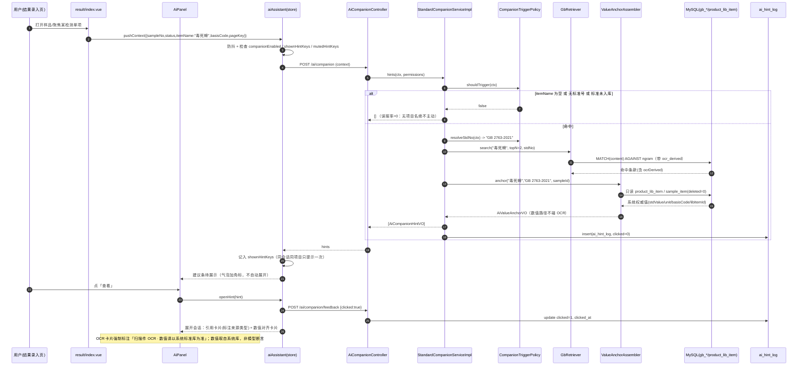
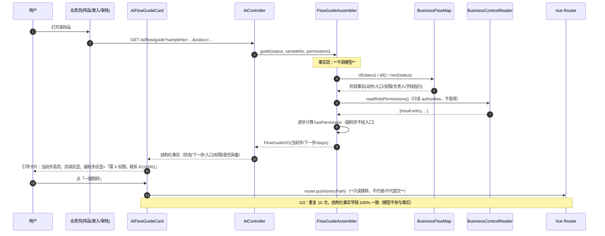
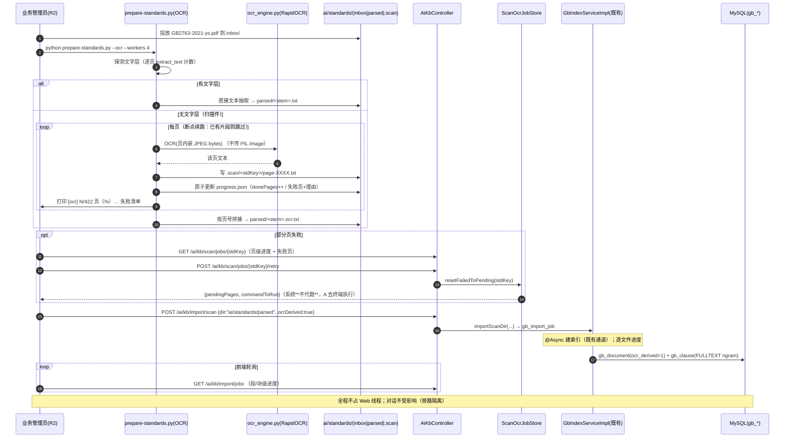
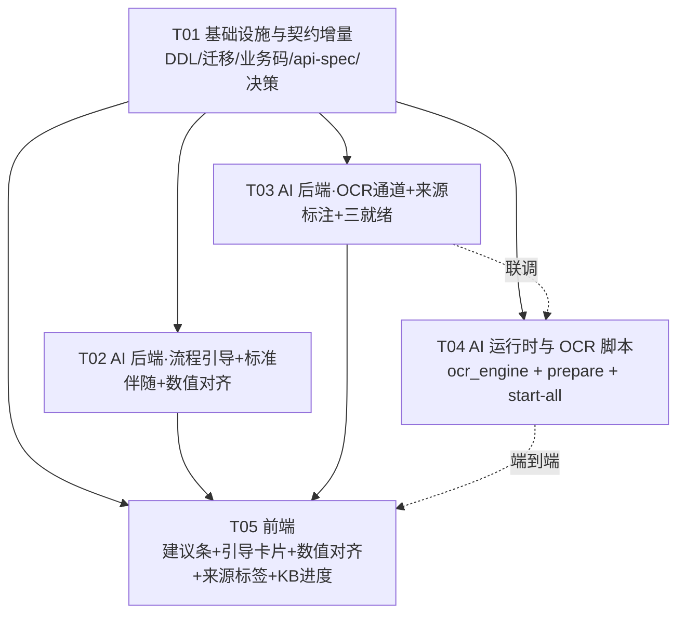

# 增量架构设计：业务全流程 AI 助手（标准伴随查询 · 确定性流程带路 · 扫描件 OCR 通道）

> 交付物类型：**增量系统设计 + 任务分解**（架构师 高见远，2026-09-18）
> 对应 PRD：`docs/design/2026-09-18-prd-ai-flow-assistant.md`（产品层裁决 **TA~TF，本设计服从**）
> 上游架构：`docs/design/2026-09-17-arch-ai-assistant-and-rollback.md`（§2.4/2.5/2.6、§4.1、§5.1 为 AI 部分现存设计）
> 增量代号：`ai_flow_assistant`
> 本文件是**唯一允许写出的代码级交付物**（架构师只出设计，不写实现）。类名/方法名/字段名/路径均写实到可直接施工。
> 配套产物：`docs/sequence-diagram.mermaid`、`docs/class-diagram.mermaid`。

---

## 0. 设计约束复核（先说清「不能碰什么」）

| 约束 | 来源 | 本设计如何遵守 |
|---|---|---|
| 判定唯一权威 `JudgeEngine`；AI 绝不写业务结论字段（`sample_info.conclusion`/`sample_result.conclusion`/`conclusion_source`/`judge_basis`） | PRD TD/G4、上轮 T3 红线 | 新增 AI 类**一律不引** `JudgeEngine`，**不写**任何业务表；数值只做**展示与跳转**，不做合格判定。红line 由 `AiDomainIsolationTest` 反射锁死并**扩容**（见 §2.6） |
| 助手不代操作（PRD TC）：只「定位入口 + 说清填什么 + 一键跳转」，不代提交/代填 | PRD TC / G5 | 新增端点全部**只读**（除 `ai_hint_log` 留痕与 OCR 侧车位复位）；前端动作只有 `router.push` 跳转，无任何表单写入 |
| **零新增 Maven 依赖**（离线本地仓；实测无 Lucene/PDFBox/Tika/AOP） | 硬约束 | 后端**不新增任何 jar**；OCR 全程离线 Python 侧 |
| **禁止 mock 假数据**；检索无命中就说没命中，绝不编造标准号 | 项目红线 | 伴随查询 0 命中 → 不提示；标准域 0 命中 → 归因「未找到」（沿用上轮 `NO_CITATION`） |
| `deleted` 语义：0=有效 / 非 0=行自身 id；查询一律 `deleted = 0`，**绝不得写 `deleted = 1` 的判定** | 上轮升级 | 本增量不触碰 `sample_item`/`sample_result` 的 `deleted`；新增只读投影 mapper 只走 `deleted = 0` |
| 统一响应 `{code,msg,data}`、`@PreAuthorize` 权限标识（核对 `db/seed/01_rbac_seed.sql`）、乐观条件 UPDATE、审计四字段自动填充、逻辑删除、新分页域 `current`/`size`、UI 只用 `--lims-*` 令牌 | AGENTS 1/4/5/6 | 全部沿用；**本增量零新增权限点**（所需 13 个权限已在 seed 定义，见 §5.4） |
| Ollama 回环口 / 零外发 / 未启动时业务不受影响 | 上轮 §2.1 | 全部沿用；伴随查询与流程引导**离线也可用**（纯确定性） |

---

## 1. 设计概览

### 1.1 ASCII 架构图（★ = 本次新增/升级）

```
                                浏览器（Vue3 + Element Plus）
   ┌──────────────────────────────────────────────────────────────────────────────────┐
   │ MainLayout.vue（唯一悬浮宿主，不动三区布局）                                        │
   │   └─ <AiFloatingAssistant>                                                        │
   │        ├─ AiBubble ★角标（有建议条待展示时，不自动展开）                              │
   │        └─ AiPanel                                                                 │
   │             ├─ ★AiCompanionBar（头部下方「建议条」：单行 + 查看 + 关闭，默认折叠）      │
   │             ├─ ★AiFlowGuideCard（引导卡片：步骤高亮 + 一键跳转，越权步灰显）           │
   │             ├─ AiMessageList / AiCitationCard ★来源标签（文本版 / 扫描件OCR）          │
   │             └─ ★AiValueAnchor（数值对齐卡片：系统标准库值 + 权限收敛跳转入口）          │
   │   stores/aiAssistant.ts ★（建议条/频控/静默集/上下文含 itemName+pageKey+roleCode）     │
   └───────────────────────────────┬──────────────────────────────────────────────────┘
                                   │ HTTPS 同源 /api（JWT）
        ┌──────────────────────────┴───────────────────────────────────────────┐
        │                Spring Boot 3.3.2（context-path=/api）                  │
        │                                                                       │
        │  【★确定性带路：业务域不调模型（TF）】      【标准伴随（TA，读）】           │
        │   AiCompanionController  /ai/companion        AiController /ai/flow/guide │
        │   AiCompanionController  /ai/companion/feedback                          │
        │        │                                             │                  │
        │   StandardCompanionService ★               FlowGuideAssembler ★          │
        │        │            │                            │                      │
        │   CompanionTrigger   ValueAnchorAssembler ★   BusinessFlowMap ★          │
        │   Policy ★（纯函数）  （只读 product_lib_item/      （S10→S90 唯一权威映射）  │
        │        │              sample_item 快照）                                  │
        │   GbRetriever（ngram，沿用）  SampleItemFactMapper ★（只读投影）           │
        │                                                                       │
        │  【OCR 通道（TD）】  AiKbController /ai/kb/scan/jobs ★                     │
        │        │                                                              │
        │   ScanOcrJobStore ★（读/复位 .scan/*.progress.json 侧车位）               │
        │        │                                                              │
        │   GbStandardsStore.diagnosePdf ★（PDF 无新依赖轻量诊断 → 4211/4212）       │
        │   AiStatusVO ★（+kbReady/kbDocCount 三就绪）                             │
        │                                                                       │
        │   ⇩ 只写 ai_* / gb_* 表；业务只读经 BusinessContextReader + 只读投影        │
        └───────┬───────────────────────────────────────────┬───────────────────┘
                │                                           │ 127.0.0.1:11434
                ▼                                           ▼
   ┌────────────────────────────────┐        ┌──────────────────────────────────────┐
   │ MySQL 8.0.45                   │        │ Ollama（仓库内便携运行时）              │
   │  既有：…                       │        │  ai/runtime/ollama.exe               │
   │  ★新增：ai_hint_log            │        │  qwen3:4b-instruct（think=false）      │
   │  ★改列：gb_document.ocr_derived │        └──────────────────────────────────────┘
   │   gb_clause(FULLTEXT ngram)     │
   └────────────────────────────────┘        ┌──────────────────────────────────────┐
                                             │  ai/standards/  GB 原始文件            │
                                             │   inbox/(投放) parsed/(产物)           │
                                             │   ★.scan/<stdKey>/page-XXXX.txt        │
                                             │   ★.scan/<stdKey>/progress.json        │
                                             │   ← ★ocr_engine.py + prepare(OCR)      │
                                             │     页级 checkpoint / 断点续跑 / 并发   │
                                             └──────────────────────────────────────┘
```

### 1.2 一段话：这次增量在既有助手上「加什么、怎么不动主线」

**这次是在昨天已交付的「问答 + 检索」助手上做三件增量，全部是旁路，业务主线一行不改：**

① **标准伴随查询（TA）**——新增 `POST /api/ai/companion`：由**页面显式带入**的 `itemName`（检测项目名）触发，后端用**纯函数触发器** `CompanionTriggerPolicy` 判定是否提示（`itemName` 为空 → 直接返回空，**误报率由构造成 0**），命中则用既有 `GbRetriever` 取 1~2 条条款预览，再附一张由 `ValueAnchorAssembler` **确定性装配**的「数值对齐卡片」（只读系统库快照）。前端把它渲染成悬浮窗内**一行默认折叠的建议条**，同会话同项目只提示一次、可一键关闭并记忆。

② **业务全流程引导（TB/TF）**——新增 `GET /api/ai/flow/guide`：由 `BusinessFlowMap`（**S10→S90 + 审核退回的唯一权威映射**）+ `FlowGuideAssembler` 把「当前状态 → 下一步动作 → 入口路由 → 所需权限 → 该角色是否具备」装配成结构化对象，**业务域完全不调模型**（事实层 100% 由代码产出）；前端用「引导卡片 + 一键跳转」呈现，越权步骤灰显并提示「需 X 权限，联系 R100/R2 开通」，**不诱导弹越权**。措辞层（模型润色）默认**关闭**（配置开关，见 §2.6）。

③ **扫描件 OCR 通道（TD）**——`prepare-standards.py` 新增 OCR 通道：自动探测文字层 → 有则文本抽取、无则 `rapidocr-onnxruntime` 逐页 OCR，**页级 checkpoint 断点续跑**、**页级进度输出**、可选 `multiprocessing` 并发；产物落到 `parsed/`，由**既有**后端异步导入通道建索引。OCR 文本**只许用于「条文引用与定位」**，数值权威永远是 `product_lib_item`（工程化落法见 §2.3）。后端**继续拒收 PDF**，但把 4211 拆成「文本版 PDF（→4211）」与「扫描版 PDF（→4212，请跑 OCR 通道）」两条**可操作诊断**。

**为什么「不动主线」是安全的**：新增能力对业务表**只有只读依赖**（`BusinessContextReader` 的 `SampleMapper` + 新增只读投影 `SampleItemFactMapper`），对 `JudgeEngine` **零引用**；所有新增接口在独立控制器下，AI 域业务码自成一区（4200–4299）；Ollama 未启动、OCR 未跑、标准库为空时，各接口各自返回可读降级，业务页面照常工作。

---

## 2. 技术选型与裁决（逐主题：选定 / 排除 / 理由 / 反例）

### 2.1 OCR 引擎与位置

- **选定**：**离线 Python 预处理**，引擎 **`rapidocr-onnxruntime`**（ONNX Runtime + 内置 PP-OCR 检测/识别模型），封装在 `ai/scripts/ocr_engine.py`，由 `ai/scripts/prepare-standards.py --ocr` 调用；产物为 `ai/standards/parsed/<stem>.txt`。**后端不参与 OCR**。
- **实测依据（今日两次实测量，直接采信）**：
  - 用户给的 `GB2763-2021-ys.pdf` 是**纯扫描件**：67MB / 422 页；每页 = 一张 1240×1753 的 JPEG（`/DCTDecode`、`/DeviceRGB`，content stream 仅 107 字节）；**页面无 `/Font`、无 ToUnicode、文字层为零**（pypdf 在 7 个抽样页共抽到 **0** 个字符）。
  - `pip install rapidocr-onnxruntime` 成功、`from rapidocr_onnxruntime import RapidOCR` 导入 OK；**入参接受 `str / bytes / Path / np.ndarray`，不接受 `PIL.Image`**（会把 `JpegImageFile` 判为类型错误）。→ **实现必须直接喂页内嵌 JPEG 的 `bytes`（或解码后的 ndarray），不得传 PIL 对象**。
  - 单页实测（CPU、单进程、喂页内嵌 JPEG `bytes`）：封面 5.6s/15 行/208 字（`GB 2763—2021 食品安全国家标准 食品中农药最大残留限量` **完全正确**）；目录页 10.2s/136 行；限量表页 9.4s/86 行。**平均 8.4 s/页 → 422 页约 59 分钟**（一次性离线任务）。
  - 质量实况：`flumetralin`→`lumetralin`、「最大」→「最人」、`0.05`→`0. 05`（见 §2.3 铁律来源）。
- **排除的备选与理由**：
  1. *后端 Java 侧 OCR（Tess4J / Tesseract JNI）* —— 需新增 Maven 依赖（本机离线仓无），且中文识别质量与 ONNX 方案差一个量级 → 直接排除。
  2. *继续用 pypdf 抽文本* —— 实测对扫描件抽到 0 字符，**不是配置问题而是物理事实**（无文字层）→ 排除。
  3. *把 PDF 交给在线 OCR API* —— 违反「零外发 / 本地化」红线 → 排除。
  4. *引入 PaddleOCR 全量（paddlepaddle）* —— 依赖体积数 GB、安装复杂、与既有 Python 环境冲突风险高；`rapidocr-onnxruntime` 是同一 PP-OCR 模型的 ONNX 轻量封装，实测可用 → 排除。
  5. *让用户在 Web 请求里等 OCR* —— 59 分钟长任务，会话时长/失败率均不可接受（PRD TD 裁决一）→ 排除。
- **反例排除（关键）**：*「既然 OCR 慢又易错，干脆不支持扫描件」* —— 用户**已明确给出**这份扫描件，且现实就是扫描版（PRD Q1 假设）；拒绝等于需求未交付。故**保留 OCR 作为现实兜底 + 并行提示「换文本版 PDF」**（文本版走既有通道、无 OCR 误差，见 §2.2/C-10）。

### 2.2 PDF 拒收判决复核 —— ★ 关键判断（保留拒收，升级诊断）

- **判决：上轮「后端拒收 PDF」的结论**保持不变**，但诊断从「一刀切」升级为「可操作分流」。理由与措辞如下：**
  - 上轮拒收的**真实动机**不是「PDF 不重要」，而是**把解析器挡在运行时之外**：PDF 是**静态语料**（进库频率低、内容不变），而解析 PDF 需要重量级依赖（PDFBox/Tika）或原生二进制（poppler），在**离线本地仓 + 零新增依赖**的约束下成本不可接受。**扫描件的出现并没有改变这个动机**——它只是把「解析」从「抽文字层」升级成了「OCR」，而 OCR 更重、更慢、更该离线跑。**故拒收依然正确。**
  - **升级点**：既然现在有了「文本版 vs 扫描版」两类现实，拒收时给出**可操作的下一步**，而不是笼统一句「请转 TXT」。新增**零依赖轻量诊断** `GbStandardsStore.diagnosePdf(byte[])`：在 PDF 字节中探测是否含 `/Font` 对象 ——
    - 含 `/Font` → **文本版 PDF** → 业务码 **4211**：`「这是文本版 PDF（有文字层），请先转文本：ai/scripts/prepare-standards.py（无需 OCR）」`；
    - 不含 `/Font` → **扫描版 PDF** → 业务码 **4212**：`「这是扫描版 PDF（无文字层），请先跑 OCR 通道：ai/scripts/prepare-standards.py --ocr（约 8~10 秒/页）」`。
  - **诊断的诚实边界（写进实现注释）**：`/Font` 探测是**启发式**（少数混合型 PDF 既含少量文字层又含大量扫描页），故**两条文案都必然指向 `prepare-standards.py`**（脚本内部会**逐页**决定走文本还是 OCR）；诊断只用于「把用户引到正确的命令行参数」，**不作为准入判定**。诊断失败（读流异常）→ 回落 4211 通用文案。**fail-loud：绝不放行、绝不静默丢弃。**
- **排除的备选**：
  1. *后端放行 PDF 并内部调 Python* —— 让后端成为「任意脚本执行器」，扩大攻击面、且违背「OCR 离线」前提 → 排除。
  2. *后端放行 PDF 并内部解析文字层* —— 无依赖可用（PDFBox/Tika 离线仓无）→ 不可行。
  3. *维持一刀切 4211* —— 用户拿到扫描件时得到的是**误导性指引**（照着转 TXT 会得到空文件）→ 排除。
- **并行更优路径（C-10）**：`prepare-standards.py` 与导入页在检测到**扫描件**时，**主动打印/提示**「可改用文本版 PDF（无 OCR 误差，走既有通道）」，把文本版标为**首选**、OCR 标为**现实兜底**。

### 2.3 OCR 文本用途边界如何工程化（★ 本案关键）

> **铁律一（来自实测）：OCR 文本只能用于「条文引用与定位」（条款号 / 标题 / 正文表述 / 适用食品类别），绝不能作为数值与判定依据。** `最大`→`最人` 这种错字若出现在限量值上，是**资质事故**。
> **铁律二：数值权威永远是 `product_lib_item`（本系统已覆盖 GB 2763-2021 农残限量）**，与上轮 T3 红线一致。

工程化落法（四条硬约束，均可用单测/走查举证）：

1. **数值路径物理隔离**：新增的 `ValueAnchorAssembler`（数值对齐卡片）**只读** `product_lib_item` 与 `sample_item` 快照，**依赖集合里不得出现** `GbClauseMapper` / `GbRetriever` / `GbClause`（即**数值路径根本不接触 OCR 文本**）。由单测断言其字段依赖集。
2. **模型禁止输出数字**：标准域系统提示追加一条硬约束 —— `「禁止输出任何具体限值数字；涉及数值时必须说'请以系统标准库为准'并引导用户查看「数值对齐」卡片」`。数值**从不由模型断言**（`answer` 文本里不出现数字断言）。
3. **引用卡片必须带来源类型**：`gb_document` 新增列 `ocr_derived TINYINT NOT NULL DEFAULT 0`；检索 SQL 回带 `d.source_type, d.ocr_derived` 到 `GbSearchHitVO` → `AiCitationVO`。前端 `AiCitationCard` 依 `ocrDerived` **强制渲染**标签：
   - `ocrDerived=false` → 标签 **「文本版」**（中性色）；
   - `ocrDerived=true` → 标签 **「扫描件 OCR · 可能有识别误差」**（警示色）+ 卡片底部固定一行 **「本条来自扫描件识别，数值请以系统标准库为准」**。
4. **OCR 片段不「抽数值」**：卡片只展示条款**片段原文**（用于定位），后端**不做**「从 OCR 片段里抽取数字单列成结论」的任何处理；`AiValueAnchorVO` 的数字全部来自系统库。

- **排除的备选**：① *把 OCR 结果当权威正文、被引用为数值来源* —— 资质事故级；② *只在 UI 加提示、后端不标来源* —— 前端一旦漏渲染就失去警示，故**来源类型由后端结构化下发**（与上轮「引用卡片是结构性必然」同源）；③ *对 OCR 文本做数字纠错（如「0. 05」→「0.05」）* —— 纠错规则无法覆盖全部错法且会引入新的错误自信，**不做**（数值一律回到系统库）。

### 2.4 OCR 通道形态（断点续跑 / 页级进度 / 并发粒度）

**形态**：`ai/standards/inbox/*.pdf` --(`prepare-standards.py --ocr`)--> 逐页片段 + 侧车位 --(完成后拼接)--> `ai/standards/parsed/<stem>.ocr.txt` --(既有 A7 接口)--> 后端异步建索引。

- **逐页 checkpoint（断点续跑）**：每页 OCR 成功后立即写一个片段文件
  `ai/standards/.scan/<stdKey>/page-0001.txt`（`stdKey` = 标准号归一化，或用文件名兜底）；`progress.json` 逐页原子更新（`temp` + `os.replace`）。**重跑**时：已存在片段页直接跳过（断点续跑），只跑缺失/失败页。
  - 为什么用**片段文件 + 收尾拼接**而不是「往单个 txt 追加」：追加语义在断点续跑下**无法保证页序**（乱序/并发写会串行错乱），而片段文件天然幂等（文件存在即该页已完成）、天然可并发（每页独立文件）、收尾按页号排序拼接即得**正确页序**。
- **页级进度输出（fail-loud）**：控制台逐页/每 N 页打印 `[ocr] 130/422 页（30.8%）… 失败 1 页`；同时写 `progress.json`（结构见 §4.5）；**失败页必须列出理由**（如「页内无图像对象」），**绝不静默丢弃**。
- **并发粒度（裁决：默认 4 进程，`--workers N` 可调，硬上限 ≤ 8）**：
  - **默认 `workers=4`**（实测本机 **32 核**，`nproc`）。理由：① OCR 是**离线一次性批处理**，「不打搅在线服务」的顾虑在本场景不成立——4 个 OCR worker 仍给同机 Ollama 留 24 核（4B 模型解码满载只需 1~2 核）；② 单进程约 59 min、4 进程约 15 min，对「一次性投 422 页」的体验差距显著；③ `onnxruntime` 单次推理**内部已多线程**，故收益**亚线性**（4 进程非 4×），需实测校准。
  - **可调 + 硬上限**：`--workers N`，**默认取 `4`，并硬性 `N ≤ 8`**（护栏：留足核给同机 Ollama 与系统；写死在脚本与本文档）。据单页 8.4s 推算：`workers=2` 约 30~35 min、`workers=4` 约 15~20 min（亚线性，随核数/内存波动）。
  - **必须实测校准（见 §9-R1）**：用 **20 页计时**外推 422 页，对比 `workers=1/2/4`；**若 4 相对于 2 的加速 < 1.5×（亚线性严重），则降到 2 并记录原因**。
  - **反例排除**：① *默认 workers=1* —— 为「不打搅在线服务」把一次性离线任务拖到近 1 小时，而本机 32 核完全放得下 4+Ollama，收益失衡；② *默认满核/不设上限* —— 无上限会与其他负载抢核、内存 × N 亦不可控，故**保留 `≤ 8` 硬上限**；③ *把并发放进后端 Web 线程* —— 仍**绝不**（OCR 永远离线，见 §2.4 末条）。
- **与后端的关系**：OCR 完成后产物是**普通 `.ocr.txt`**，由**既有** `POST /api/ai/kb/import/scan` 建索引（新增 `ocrDerived` 透传）。**页级 OCR 进度**由后端一个**只读**端点 `GET /api/ai/kb/scan/jobs` 读侧车位暴露给 UI（见 §3.3/§4.5），**不占 Web 线程**。

### 2.5 「自动查询对应标准」的机制（TA）

- **触发条件（必须可判定，逐字落到代码）**：`CompanionTriggerPolicy.shouldTrigger(ctx)` 为真 **当且仅当**：
  1. `ctx.itemName` **非空白**（页面已把「当前正在看的检测项目名」显式带入）；**且**
  2. 能解析出**标准号**：`ctx.basisCode` 非空（优先），否则 `itemName` 能在 `product_lib_item` 命中一条带 `basis_code` 的记录；**且**
  3. 该标准号归一化后能在 **`gb_document`** 命中至少 1 篇已建索引文档（`status=1`）。
  - **`itemName` 为空 → 立即返回空列表**。→ **G1「误报率 = 0」由构造保证**（无项目名绝不主动）。
- **上下文来源**：页面把上下文显式带入（沿用既有 `context` 字段并扩语义）：`sampleNo` / `status` / `itemName` / `basisCode` / `pageKey` / `roleCode` / `stdNo`。后端**不猜页面**（PRD TB）；`sampleNo` 仅用于**补全**（如用户显式问「这样品涉及哪些标准」时，经只读投影 `SampleItemFactMapper` 取 `item_name/basis_code/std_value`）。
- **先查本系统还是先查 GB 文本库**：**先系统库、再文本库**。系统库（`product_lib_item`）提供**权威的「项目名↔标准号↔限值」映射**（数值与判定依据）；GB 文本库（`gb_clause`）提供**条款出处与正文**（用于引用与定位）。即：**用系统库确定「该引用哪个标准」，用文本库找到「这个标准怎么说」。**
- **结果呈现（一行建议条 + 频控 + 可关闭）**：
  - 后端返回 `List<AiCompanionHintVO>`，每条含：`hintKey`（=`sampleNo|itemName|stdNo`，供前端去重）、`oneLine`（如「本条涉及 GB 2763-2021，查看对应限量出处」）、`stdNo/stdTitle`、`citationPreview`（top 1~2 条，含 `ocrDerived`）、`valueAnchor`（数值对齐卡片）。
  - 前端：悬浮窗**头部下方单行建议条**，**默认折叠**、**不自动展开会话、不自动聚焦输入框、不遮挡操作区**（遵守 AGENTS 5.1 数据密集区红线）；`收起态`气泡加**不打扰小角标**。
  - **频控**：前端在**会话级 Set** 里记 `hintKey` —— **同项目同会话只提示一次**；用户**关闭一次**后 `hintKey` 进**静默集**（`sessionStorage['lims_ai_muted_hint_keys']`），本会话对该项目**静默**；全局开关 `lims_ai_companion_on`（默认开，可一键关并记忆，PRD Q3）。
- **怎么保证它不变成自动判定（三条工程约束）**：
  1. `/ai/companion` **只读**：不写任何业务表、不写结论字段、不调 `JudgeEngine`（单测锁死）；
  2. **只给「查看/跳转」动作**：建议条的按钮是「查看」（打开会话展示引用卡片+数值对齐），数值对齐卡片的 CTA 是**跳转到系统标准库入口**（读）；**无任何「填入/提交」按钮**；
  3. **判定文案固定**：所有相关卡片底部固定「AI 建议，仅供参考；判定以系统规则为准」。

### 2.6 「业务全流程引导」的机制（TB/TF）—— 事实层 / 措辞层分离

- **形态（两种并存，职责分明）**：
  - **下一步提示（主）**：`GET /api/ai/flow/guide`（页面打开某样品即调用，无需对话）→ 返回结构化 `FlowGuideVO`：「你在第几步 / 下一步做什么 / 入口在哪 / 需要什么权限 / 你是否具备」。
  - **分步引导（辅）**：对话里说「我要登记新样品」→ `BusinessRuleAssembler` 识别 `Intent.GUIDE` → 用 `BusinessFlowMap` 给出**该角色**的**分步 checklist**（每步带入口）。
- **事实层（100% 由代码装配，不调模型）**：`FlowGuideAssembler` 以 `BusinessFlowMap` 为**唯一权威**，装配 5 个确定性事实字段：`{ 当前状态, 下一步动作, 入口路由, 所需权限, 是否具备 }`。业务域**完全不调模型**（承接上轮 TF：能确定性回答的一律不交给模型）。
- **措辞层（默认关闭，配置开关）**：模型**只允许润色描述性文字，不得生成/改写任何事实字段**。落地为 `lims.ai.flow.phrasing-enabled`（**默认 `false`**）：关闭时 `answer` 文本也由代码装配（零幻觉、离线可用）；开启时把**事实对象作为 ground truth** 注入提示，模型仅产出 `answer` 散文，**结构化事实字段依旧原样下发**（前端与单测以结构化字段为准）。→ G3「重复 10 次事实字段 100% 一致」对**结构化字段**成立。
- **映射表（★ 必须写全；状态机 S10→S90 是唯一权威，七阶段为主线归并）**：

  | 状态 | 状态名 | 七阶段归属 | 下一步动作（主语=下一步做什么） | 入口路由 | 所需权限 | 负责人 | 字段/按钮级指引 |
  |---|---|---|---|---|---|---|---|
  | S10 | 已登记 | P2 样品登记 | 登记确认 | `/sample`（列表行「登记确认」） | `sample:confirm` | 登记员 R1 | 选中样品 → 点「登记确认」；如需改信息先「编辑」 |
  | S20 | 登记确认 | P3 项目分解 | 项目分解 | `/item/decompose` | `item:decompose` | 任务管理员 R2 | 打开样品 → 「套库预览」→ 调整项次/增删 → 「确认保存」 |
  | S30 | 已分解 | P4 任务安排 | 任务安排 | `/assign/index` | `assign:confirm` | 任务管理员 R2 | 「自动分配」→ 必要时「人工改派」→ 「确认安排」 |
  | S40 | 已安排 | P5 检验录入 | 录入检验结果 | `/result/entry` | `result:entry` | 检验员 R3 | 打开样品 → 逐项填「检验结果」→ 「保存录入」（首次保存 S40→S50） |
  | S50 | 检验中 | P5 检验录入 | 继续录入 / 提交 | `/result/entry` | `result:entry` | 检验员 R3 | 录齐全部项 → 「提交」（S50→S60） |
  | S60 | 检验完成 | P6 审核签发 | 审核 | `/report/audit` | `report:audit` | 审核人 R100 | 打开报告 → 「审核通过」（S60→S70）或「退回」（见下行） |
  | S70 | 已审核 | P6 审核签发 | 签发 | `/report/audit` | `report:sign` | 签发人 R100 | 打开 → 「签发」（S70→S80） |
  | S80 | 已签发 | P7 报告生成 | 生成报告 | `/report/generate` | `report:generate` | 报告员 R100 | 「生成报告」（S80→S90）→ 「打印」 |
  | S90 | 已出报告 | P7 报告生成 | 上报导出 / 归档 | `/export/province` | `export:province` | 报告员 R100 | 「导出省平台 Excel」；纠错只能走「作废/召回」 |
  | — | 审核退回 | 逆向（P6→P5） | 退回检验员重录 | `/report/audit` | `report:audit` | 审核人 R100 | 「退回」→ 样品回 S50 并通知检验员（`RETURN` 白名单） |
  | — | 纠错回退 | 逆向（逐级） | 回退一步 | `/rollback`（或页面回退入口） | `rollback:execute` / 敏感边 `rollback:sensitive` | R2/R100 | 见上轮设计 §4.2（`ROLLBACK` 白名单） |
  | — | 报告作废/召回 | S80/S90 治理 | 作废 / 召回 | `/report/generate`（或作废入口） | `report:void` | R2/R100 | 见上轮设计 §4.2 B6 |

  > 说明：`BusinessFlowMap` 以**状态机**（`SampleStatus` + `SampleStatusTransition`）为唯一权威；「七阶段」为主线归并（P1 基础数据准备、P2~P7 见上表，P1 为前置无样品状态）。**任何新增/变更状态或入口，必须先改 `BusinessFlowMap` + 单测**（对齐「增删状态的唯一入口」约定）。
- **「怎么不变成第二个菜单/文档站」（三条硬要求落地）**：① 引导卡片每步都带**可点击入口**（`router.push`），不是纯文字；② 每条提示以「**下一步该做什么**」为主语（`nextAction` 字段），不是「模块有哪些功能」；③ 指引到**按钮/字段级**（`fieldHint` 字段，见上表末列）。
- **排除的备选**：① *让模型自由生成流程步骤* —— 违反 TF（同问不同答 + 事实幻觉）；② *纯静态帮助中心* —— 无法感知状态；③ *把整条链路都交给模型润色* —— 默认关闭，仅作可选措辞层。

### 2.7 权限收敛（TE）

- **裁决落地**：讲流程可以、讲入口按权限收敛、越权要明说「需要什么权限、找谁开」，**不诱导越权**。`FlowGuideAssembler.guide(..., permissions)` 对每一步计算 `hasPermission`；**`hasPermission=false` 的步骤：灰显、不给跳转按钮**，改为一行说明「需 `report:audit` 权限，当前角色不具备；请联系 R100 / R2 开通」。
- **只读权限集合**：复用 `BusinessContextReader.readRolePermissions()`（取自认证上下文 authorities，**不查库、不缓存**）；`FlowGuideAssembler` 只读，**不越权查询、不展示超权限入口/数据**。
- **具体口径示例**：检验员问「怎么审核报告」→ **讲流程**（审核是 P6 环节、S60→S70 的含义），**不给审核入口**（其无 `report:audit`），改提示「需 `report:audit` 权限，找 R100 开通」。
- **跳转目标以「对象权限」为准（★ 团队裁决 R8，2026-09-18）**：判断「能否跳」应看用户对**目标对象**的权限，而非「该字段所在的基础数据页」的权限。落到数值对齐卡片：能看全量项目库（`base:lib:list`）→ 跳基础数据页；否则若能看**本样品**（`result:entry`/`item:decompose`）→ 跳**该样品自己的**录入/分解详情；两者皆无 → 才只展示值。**「跳到自己正在处理的样品明细」不构成越权扩张**（详见 §4.2 三级回退）。
- **排除的备选**：① *一律不答越权流程*（检验员会搞不清链路，违背「业务全流程辅助」）；② *有问必答且给入口*（资质系统里是合规问题）；③ *数值对齐一律「只展示值不跳转」*（虽安全，但让有本样品权限的 R3「看得到数却无路可去」，是过度收敛——以对象权限为准即可两全）。

### 2.8 一键启动 + 三项就绪自检（C-11）

- **选定**：`ai/scripts/start-all.ps1`（新）按序拉起 **Ollama → 后端 → 前端**，并轮询三项就绪；就绪状态由**既有** `GET /api/ai/status` 的**扩展字段**给出（`online` / `modelPresent` / **`kbReady`+`kbDocCount`**）。任一不就绪 → 打印**具体下一步命令**（fail-loud，非 0 退出）。
- **排除**：*Docker Compose 托管*（仓库可搬性 + 沙箱不确定）、*前端页面内轮询拼装启动*（启动是运维动作，不该进业务 UI）。

---

## 3. 数据模型

### 3.1 新增表 `ai_hint_log` —— 助手主动提示留痕（C-12，P1）

```sql
-- db/init/12_ai_hint_log.sql
-- 定位：把「助手何时/对谁/在什么上下文/主动提示了什么/是否被点开」记成追加型事件，
--       供事后审计与护栏/触发质量复盘（与 ai_message 互补：前者记主动提示，后者记问答）。
-- 只追加、不改写；无 UPDATE/DELETE 入口（点击回填 clicked/clicked_at 属状态推进，语义上非「改写历史」）。
DROP TABLE IF EXISTS `ai_hint_log`;
CREATE TABLE `ai_hint_log` (
  `id`              BIGINT       NOT NULL AUTO_INCREMENT COMMENT '主键',
  `user_no`         VARCHAR(64)  NOT NULL COMMENT '触发用户工号',
  `conversation_id` BIGINT                DEFAULT NULL COMMENT '关联会话（若已开对话）',
  `sample_no`       VARCHAR(50)           DEFAULT NULL COMMENT '上下文样品编号',
  `page_key`        VARCHAR(64)           DEFAULT NULL COMMENT '来源页面标识（如 result-entry）',
  `item_name`       VARCHAR(100)          DEFAULT NULL COMMENT '检测项目名（触发键之一）',
  `std_no`          VARCHAR(50)           DEFAULT NULL COMMENT '命中的标准号',
  `hint_key`        VARCHAR(200) NOT NULL COMMENT '去重键 sampleNo|itemName|stdNo',
  `hint_text`       VARCHAR(500)          DEFAULT NULL COMMENT '建议条文案（一行）',
  `context_json`    JSON                  DEFAULT NULL COMMENT '当次上下文快照（供复盘）',
  `clicked`         TINYINT      NOT NULL DEFAULT 0 COMMENT '是否被点开 0=否 1=是',
  `clicked_at`      DATETIME              DEFAULT NULL COMMENT '点开时间',

  `created_by`      VARCHAR(64)           DEFAULT NULL COMMENT '创建人',
  `created_at`      DATETIME              DEFAULT NULL COMMENT '创建时间',
  `updated_by`      VARCHAR(64)           DEFAULT NULL COMMENT '更新人',
  `updated_at`      DATETIME              DEFAULT NULL COMMENT '更新时间',
  `deleted`         TINYINT      NOT NULL DEFAULT 0 COMMENT '逻辑删除 0=否 1=是（不使用）',

  PRIMARY KEY (`id`),
  KEY `idx_ahk_hint_key` (`hint_key`),
  KEY `idx_ahk_user_created` (`user_no`, `created_at`),
  KEY `idx_ahk_std_no` (`std_no`)
) ENGINE=InnoDB DEFAULT CHARSET=utf8mb4 COLLATE=utf8mb4_general_ci COMMENT='AI 助手主动提示留痕（追加型，可审计）';
```

### 3.2 既有表增量（`db/migrations/V9__ai_flow_assistant.sql`）

```sql
-- =============================================================================
-- V9__ai_flow_assistant.sql —— 业务全流程 AI 助手增量（可重跑、含校验 SELECT）
-- 前置：db/init/05..12 + V1..V8
-- 说明：本增量**不动任何业务表**（主线零回归）；仅新增助手留痕表 + 给 GB 派生索引
--       加一个「来源是否 OCR」标记（用于引用卡片可信度标注）。
-- =============================================================================
SET NAMES utf8mb4;

-- 1) 助手主动提示留痕（若 db/init/12 已建则跳过）
CREATE TABLE IF NOT EXISTS `ai_hint_log` (
  `id`              BIGINT       NOT NULL AUTO_INCREMENT COMMENT '主键',
  `user_no`         VARCHAR(64)  NOT NULL COMMENT '触发用户工号',
  `conversation_id` BIGINT                DEFAULT NULL COMMENT '关联会话',
  `sample_no`       VARCHAR(50)           DEFAULT NULL COMMENT '上下文样品编号',
  `page_key`        VARCHAR(64)           DEFAULT NULL COMMENT '来源页面标识',
  `item_name`       VARCHAR(100)          DEFAULT NULL COMMENT '检测项目名',
  `std_no`          VARCHAR(50)           DEFAULT NULL COMMENT '命中的标准号',
  `hint_key`        VARCHAR(200) NOT NULL COMMENT '去重键 sampleNo|itemName|stdNo',
  `hint_text`       VARCHAR(500)          DEFAULT NULL COMMENT '建议条文案',
  `context_json`    JSON                  DEFAULT NULL COMMENT '当次上下文快照',
  `clicked`         TINYINT      NOT NULL DEFAULT 0 COMMENT '是否被点开',
  `clicked_at`      DATETIME              DEFAULT NULL COMMENT '点开时间',
  `created_by`      VARCHAR(64)           DEFAULT NULL,
  `created_at`      DATETIME              DEFAULT NULL,
  `updated_by`      VARCHAR(64)           DEFAULT NULL,
  `updated_at`      DATETIME              DEFAULT NULL,
  `deleted`         TINYINT      NOT NULL DEFAULT 0,
  PRIMARY KEY (`id`),
  KEY `idx_ahk_hint_key` (`hint_key`),
  KEY `idx_ahk_user_created` (`user_no`, `created_at`),
  KEY `idx_ahk_std_no` (`std_no`)
) ENGINE=InnoDB DEFAULT CHARSET=utf8mb4 COLLATE=utf8mb4_general_ci COMMENT='AI 助手主动提示留痕';

-- 2) GB 派生索引：来源是否为扫描件 OCR（用于引用卡片可信度标注；派生索引允许原地重建）
--    db/init/11_ai_tables.sql 的 gb_document 已含该列（全新部署）；存量库走此 ALTER。
ALTER TABLE `gb_document`
  ADD COLUMN `ocr_derived` TINYINT NOT NULL DEFAULT 0
  COMMENT '是否来自扫描件 OCR 0=否（文本版）1=是（数值请以系统标准库为准）'
  AFTER `source_type`;

-- 3) 校验 SELECT（人工核对，fail-loud：应然≠实然即人工介入）
SELECT 'ai_hint_log.exists' AS item, COUNT(*) AS cnt
  FROM information_schema.TABLES
 WHERE TABLE_SCHEMA = DATABASE() AND TABLE_NAME = 'ai_hint_log';
SELECT 'gb_document.ocr_derived.type' AS item, COLUMN_TYPE AS val
  FROM information_schema.COLUMNS
 WHERE TABLE_SCHEMA = DATABASE() AND TABLE_NAME = 'gb_document' AND COLUMN_NAME = 'ocr_derived';

-- 4) ngram 就绪自检（沿用上轮；应返回 1）
SELECT 'ngram_active' AS item, COUNT(*) AS cnt
  FROM information_schema.PLUGINS WHERE PLUGIN_NAME = 'ngram' AND PLUGIN_STATUS = 'ACTIVE';
```

> `db/init/11_ai_tables.sql` 同步在 `gb_document` 建表语句里加 `ocr_derived TINYINT NOT NULL DEFAULT 0`（全新部署口径）。**业务表（`sample_info`/`sample_item`/`sample_result`/…）零改动。**

### 3.3 OCR 侧车位文件契约（文件即接口：Python ↔ 后端 ↔ UI）

`ai/standards/.scan/<stdKey>/progress.json`（`stdKey` = 归一化标准号，如 `GB-2763-2021`；未识别到则用文件名 stem）：

```json
{
  "stdKey": "GB-2763-2021",
  "sourceFile": "GB2763-2021-ys.pdf",
  "stdNo": "GB 2763-2021",
  "mode": "ocr",
  "fingerprint": "sha256:9f1c…",
  "totalPages": 422,
  "donePages": 130,
  "failedPages": [ { "page": 121, "reason": "页内无图像对象" } ],
  "outputTxt": "GB2763-2021-ys.ocr.txt",
  "status": "running",
  "startedAt": "2026-09-18 09:10:00",
  "updatedAt": "2026-09-18 09:28:41"
}
```

- `status`：`pending | running | done | partial_failed`；`donePages` = 片段文件数；`failedPages` **必须逐页列出理由**。
- 后端 `ScanOcrJobStore` **只读**该目录做展示；`retry` 仅把 `failedPages` 清空为待跑（写 `pendingRetry=true` 或删对应片段标记），**不代跑 OCR**。
- `progress.json` 写用**原子替换**（写 `.tmp` 再 `os.replace`），避免后端读到半截 JSON。

### 3.4 关系与关键类图（Mermaid `classDiagram`）

（同 `docs/class-diagram.mermaid`）

```mermaid
classDiagram
  class AiChatContextDTO {
    +String sampleNo
    +Integer status
    +String stdNo
    +String itemName  「★新增」
    +String basisCode 「★新增」
    +String pageKey   「★新增」
    +String roleCode  「★新增」
  }
  class AiAnswerVO {
    +String answer
    +boolean refused
    +String domain
    +String confidence
    +List~AiCitationVO~ citations
    +List~Suggestion~ suggestions
    +FlowGuideVO flowGuide 「★新增」
    +List~AiValueAnchorVO~ valueAnchors 「★新增」
  }
  class AiCitationVO {
    +String stdNo
    +String clauseNo
    +String snippet
    +Integer sourceType 「★新增」
    +String sourceTypeLabel 「★新增」
    +boolean ocrDerived 「★新增」
  }
  class FlowGuideVO {
    +String sampleNo
    +Integer currentStatus
    +String currentStatusLabel
    +int stageIndex
    +Step nextStep
    +List~Step~ steps
  }
  class FlowGuideVO.Step {
    +Integer status
    +String stageLabel
    +String nextAction
    +String entryPath
    +String requiredPermission
    +boolean hasPermission
    +String fieldHint
    +boolean isCurrent
  }
  class AiCompanionHintVO {
    +String hintKey
    +String sampleNo
    +String itemName
    +String stdNo
    +String stdTitle
    +String oneLine
    +List~AiCitationVO~ citationPreview
    +AiValueAnchorVO valueAnchor
  }
  class AiValueAnchorVO {
    +String itemName
    +String unit
    +String stdValue
    +String judgeTypeLabel
    +boolean isReference
    +String basisCode
    +Long libItemId
    +String jumpScope 「★L/S/N」
    +String jumpLabel
    +String jumpPath
    +String sourceLabel
  }
  class ScanOcrJobVO {
    +String stdKey
    +String sourceFile
    +String stdNo
    +String mode
    +Integer totalPages
    +Integer donePages
    +List~FailedPage~ failedPages
    +String status
    +String updatedAt
  }
  class BusinessFlowMap {
    <<static 权威>>
    +StageFact of(SampleStatus) StageFact
    +List~StageFact~ all()
    +Optional~StageFact~ next(SampleStatus)
  }
  class FlowGuideAssembler {
    +FlowGuideVO guide(Integer status, String sampleNo, List~String~ perms)
  }
  class CompanionTriggerPolicy {
    +boolean shouldTrigger(AiChatContextDTO ctx)
    +Optional~String~ resolveStdNo(AiChatContextDTO ctx)
    +String hintKey(AiChatContextDTO ctx, String stdNo)
  }
  class StandardCompanionService {
    <<interface>>
    +List~AiCompanionHintVO~ hints(AiChatContextDTO ctx, List~String~ perms)
    +boolean feedback(AiCompanionFeedbackDTO dto)
  }
  class ValueAnchorAssembler {
    +Optional~AiValueAnchorVO~ anchor(String itemName, String stdNo, Long sampleId, List~String~ perms)
  }
  class ScanOcrJobStore {
    +List~ScanOcrJobVO~ list()
    +Optional~ScanOcrJobVO~ get(String stdKey)
    +ScanOcrRetryVO resetFailedToPending(String stdKey)
  }
  class BusinessContextReader {
    +readStatus(sampleNo) Optional~SampleStatusView~
    +readRolePermissions() List~String~
  }
  class SampleItemFactMapper {
    <<只读投影 @Select>>
    +selectFactsBySampleNo(sampleNo) List~SampleItemFact~
  }
  class GbRetriever {
    +search(query, topN, stdNo) List~GbSearchHitVO~
  }
  class BusinessRuleAssembler {
    +detectIntent(question) Intent
    +answer(intent, question, ctx) String
  }
  class AiAssistantServiceImpl {
    +status() AiStatusVO
    +chat(dto) AiAnswerVO
    +chatStream(dto) SseEmitter
  }

  AiAssistantServiceImpl --> FlowGuideAssembler : 业务域 NEXT_STEP/GUIDE
  AiAssistantServiceImpl --> BusinessRuleAssembler
  AiAssistantServiceImpl --> GbRetriever
  AiAssistantServiceImpl --> AiConversation : 只写 ai_message/ai_conversation
  FlowGuideAssembler --> BusinessFlowMap : 唯一权威映射
  FlowGuideAssembler --> BusinessContextReader : 只读角色权限
  StandardCompanionServiceImpl --> CompanionTriggerPolicy
  StandardCompanionServiceImpl --> GbRetriever : 条款预览
  StandardCompanionServiceImpl --> ValueAnchorAssembler
  StandardCompanionServiceImpl --> SampleItemFactMapper : 只读补全
  StandardCompanionServiceImpl --> AiHintLog : 留痕（唯一写）
  ValueAnchorAssembler --> ProductLibItem : 只读系统标准库
  ValueAnchorAssembler ..> GbRetriever : ✗ 禁止依赖（数值路径不碰 OCR）
  ScanOcrJobStore --> ScanOcrJob : .scan/*/progress.json（文件）
```



---

## 4. 接口契约增量（可直接并入 `docs/api/api-spec.md` 第 16 章）

> 统一前缀 `/api`；鉴权 `Authorization: Bearer`；响应 `{code,msg,data}`；分页 data = `records/total/current/size`；字段 camelCase。
> **AI 域业务码 4200–4299**（0.2 段位登记）：本增量新增 **4204 / 4205 / 4212**；4211 文案按 PDF 类型分流。

### 4.1 新增端点一览

| # | 方法 | 路径 | 权限标识 | 说明 |
|---|---|---|---|---|
| A14 | POST | `/ai/companion` | `ai:chat` | **标准伴随查询**（上下文触发；`itemName` 空 → 返回 `[]`） |
| A15 | POST | `/ai/companion/feedback` | `ai:chat` | 建议条留痕（是否被点开）→ 写 `ai_hint_log` |
| A16 | GET | `/ai/flow/guide` | `ai:chat` | **确定性流程引导**（当前状态→下一步/入口/权限/是否具备） |
| A17 | GET | `/ai/kb/scan/jobs` | `ai:kb:import` | 扫描件 OCR 任务列表（读侧车位，页级进度） |
| A18 | GET | `/ai/kb/scan/jobs/{stdKey}` | `ai:kb:import` | 单个 OCR 任务详情（逐页进度 + 失败页清单） |
| A19 | POST | `/ai/kb/scan/jobs/{stdKey}/retry` | `ai:kb:import` | 复位失败页为待跑 + 返回**待执行命令**（**不代跑**） |

### 4.2 A14 请求 / 响应

```json
// 请求（AiChatContextDTO；itemName 是触发的必要条件）
{ "sampleNo": "JK(2023)-SA-001", "status": 50,
  "itemName": "毒死蜱", "basisCode": "GB 2763-2021",
  "pageKey": "result-entry", "roleCode": "R3" }
// 响应 data（List<AiCompanionHintVO>；无触发/无命中 → []）
[ { "hintKey": "JK(2023)-SA-001|毒死蜱|GB 2763-2021",
    "sampleNo": "JK(2023)-SA-001", "itemName": "毒死蜱",
    "stdNo": "GB 2763-2021", "stdTitle": "食品安全国家标准 食品中农药最大残留限量",
    "oneLine": "本条涉及 GB 2763-2021，查看对应限量出处",
    "citationPreview": [
      { "stdNo": "GB 2763-2021", "clauseNo": "表135", "clauseTitle": "毒死蜱残留限量",
        "snippet": "……牛肝 0.05 mg/kg……", "docId": 7, "sourceFile": "GB2763-2021-ys.ocr.txt",
        "sourceType": 5, "sourceTypeLabel": "扫描件OCR", "ocrDerived": true, "score": 3.7 } ],
    "valueAnchor": {
      "itemName": "毒死蜱", "unit": "mg/kg", "stdValue": "≤0.05",
      "judgeTypeLabel": "限量比较", "isReference": false,
      "basisCode": "GB 2763-2021", "libItemId": 448,
      "jumpScope": "SAMPLE", "jumpLabel": "查看本样品该项目明细",
      "jumpPath": "/result/entry?sampleId=1024&itemId=8871",
      "sourceLabel": "系统标准库（权威）" } } ]
```
无触发（`itemName` 空）或标准未入库 → `{ "code": 0, "msg": "success", "data": [] }`（**不是错误**，fail-soft）。

> **数值对齐的跳转目标（★ 团队裁决 R8，2026-09-18）**：跳转目标以「用户对该**对象**的权限」为准，**不以「该字段所在基础数据页的权限」为准**。三级回退（由 `ValueAnchorAssembler` 在装配时按当前用户权限选定 `jumpScope`）：
> 1. **有 `base:lib:list`** → `jumpScope="LIBRARY"`，跳 `/query/lib?itemName=…`（看全量项目库/判定依据）；
> 2. **无 `base:lib:list` 但有 `result:entry`（或 `item:decompose`）** → `jumpScope="SAMPLE"`，跳**该样品自己的**录入/分解详情（`/result/entry?sampleId=…` 或 `/item/decompose?sampleId=…`，按样品当前状态选页）——用户本就对该样品有权限，**不构成越权扩张**；
> 3. **两条都不可达** → `jumpScope="NONE"`，卡片**只展示值** + 一行「查看入口需 `base:lib:list` 权限」。
> 无论哪一级，卡片仅**展示**系统库值 + 提供**读跳转**；**不代填、不代提交、不做合格判定**。

### 4.3 A15 请求 / 响应

```json
// 请求
{ "hintKey": "JK(2023)-SA-001|毒死蜱|GB 2763-2021", "sampleNo": "JK(2023)-SA-001",
  "itemName": "毒死蜱", "stdNo": "GB 2763-2021", "pageKey": "result-entry", "clicked": true }
// 响应 data
true
```

### 4.4 A16 请求 / 响应

```json
// GET /api/ai/flow/guide?sampleNo=JK(2023)-SA-001&status=40   （两者皆可空：空则返回总览，不标当前步）
// 响应 data（FlowGuideVO）
{ "sampleNo": "JK(2023)-SA-001", "currentStatus": 40, "currentStatusLabel": "已安排", "stageIndex": 4,
  "nextStep": { "status": 50, "stageLabel": "已安排", "nextAction": "录入检验结果",
    "entryPath": "/result/entry", "requiredPermission": "result:entry", "hasPermission": true,
    "fieldHint": "打开样品 → 逐项填「检验结果」→ 「保存录入」", "isCurrent": true },
  "steps": [
    { "status": 10, "stageLabel": "已登记",   "nextAction": "登记确认", "entryPath": "/sample",
      "requiredPermission": "sample:confirm", "hasPermission": false, "fieldHint": "选中样品 → 点「登记确认」", "isCurrent": false },
    { "status": 20, "stageLabel": "登记确认", "nextAction": "项目分解", "entryPath": "/item/decompose",
      "requiredPermission": "item:decompose", "hasPermission": false, "fieldHint": "「套库预览」→「确认保存」", "isCurrent": false },
    { "status": 40, "stageLabel": "已安排",   "nextAction": "录入检验结果", "entryPath": "/result/entry",
      "requiredPermission": "result:entry", "hasPermission": true, "fieldHint": "…", "isCurrent": true },
    { "status": 60, "stageLabel": "检验完成", "nextAction": "审核", "entryPath": "/report/audit",
      "requiredPermission": "report:audit", "hasPermission": false, "fieldHint": "打开报告 →「审核通过」", "isCurrent": false } ] }
```
> 越权步骤 `hasPermission=false` 且**不提供跳转**（前端灰显 + 文案「需 `report:audit` 权限，联系 R100/R2 开通」）。

### 4.5 A17 / A18 / A19

```json
// A17 data（List<ScanOcrJobVO>，来自 ai/standards/.scan/*/progress.json）
[ { "stdKey": "GB-2763-2021", "sourceFile": "GB2763-2021-ys.pdf", "stdNo": "GB 2763-2021",
    "mode": "ocr", "totalPages": 422, "donePages": 130,
    "failedPages": [ { "page": 121, "reason": "页内无图像对象" } ],
    "status": "running", "percent": 30.8,
    "outputTxt": "GB2763-2021-ys.ocr.txt", "updatedAt": "2026-09-18 09:28:41" } ]

// A19 data（ScanOcrRetryVO）—— 复位失败页为待跑，并**返回待用户执行的命令**（不代跑）
{ "stdKey": "GB-2763-2021", "pendingPages": [121],
  "commandToRun": "python ai/scripts/prepare-standards.py --ocr --std-key \"GB-2763-2021\"",
  "note": "OCR 为离线长任务，请在上图终端执行该命令；本系统不代替运行。" }
```

### 4.6 既有端点契约扩展（向后兼容）

| 端点 | 扩展 |
|---|---|
| A2/A3 `/ai/chat` `/ai/chat/stream` | `context` 增加 `itemName/basisCode/pageKey/roleCode`（全部可选）；`data` 增加 `flowGuide`、`valueAnchors[]`；`citations[]` 增加 `sourceType/sourceTypeLabel/ocrDerived`；SSE `refs` 事件载荷同步带 `flowGuide/valueAnchors` |
| A1 `/ai/status` | `data` 增加 `kbReady`（是否已入库 ≥1 篇标准）、`kbDocCount`（已入库文档数）；供 C-11 三就绪自检 |
| A7 `/ai/kb/import/scan` | 请求增加 `ocrDerived`（Boolean，可选；未传则按文件名后缀 `.ocr.txt` 自动判定） |
| A11 `/ai/kb/documents` | 响应 `records[]` 增加 `ocrDerived` + `ocrDerivedLabel` |

### 4.7 AI 业务码（增量）

| 场景 | code | msg |
|---|---|---|
| 上传**文本版** PDF | 4211 | 这是文本版 PDF（有文字层），请先转文本：ai/scripts/prepare-standards.py（无需 OCR） |
| 上传**扫描版** PDF | **4212** | 这是扫描版 PDF（无文字层），请先跑 OCR 通道：ai/scripts/prepare-standards.py --ocr（约 8~10 秒/页） |
| OCR 任务不存在 | **4204** | 未找到该扫描件任务（请先在 ai/standards/inbox 投放 PDF 并运行预处理） |
| OCR 任务进行中（不可复位） | **4205** | 该 OCR 任务正在进行中，请待其结束后再重试失败页 |

> 全部 HTTP 200 + code≠0（业务码），前端按码展示**可操作提示**；4211/4212 在 `MultipartFile` 上传路径抛出 `BizException`（HTTP 400 + `{code,msg}`），与既有 4211 一致。

---

## 5. 代码结构（完整文件清单，逐条标注 新增/修改）

> 路径除特别注明外，后端相对 `backend/src/main/java/com/lims/`，前端相对 `frontend/src/`。

### 5.1 后端 —— 新增

| 路径 | 职责 | 关键类 / 方法 |
|---|---|---|
| `service/ai/flow/BusinessFlowMap.java` | **S10→S90 唯一权威映射**（状态→阶段/动作/入口/权限/负责人/字段指引） | `record StageFact(SampleStatus status, String stageLabel, String nextAction, String entryPath, String requiredPermission, String actorRole, String fieldHint)`；`of(SampleStatus)`, `all()`, `next(SampleStatus)`, `RETURN_FACT`（退回）/`VOID_FACT`（作废） |
| `service/ai/flow/FlowGuideAssembler.java` | 装配 `FlowGuideVO`（事实层，不调模型） | `guide(Integer statusCode, String sampleNo, List<String> permissions)`：解析状态→组装 steps（逐步算 `hasPermission`）→ 定位 `nextStep` |
| `service/ai/companion/CompanionTriggerPolicy.java` | 触发/闭嘴/频控键（**纯函数，可单测**） | `shouldTrigger(ctx)`、`resolveStdNo(ctx)`、`hintKey(ctx, stdNo)`、`normalizeStdNo(String)` |
| `service/ai/companion/StandardCompanionService.java` | 标准伴随服务接口 | `hints(AiChatContextDTO, List<String>)`、`feedback(AiCompanionFeedbackDTO)` |
| `service/ai/companion/impl/StandardCompanionServiceImpl.java` | 伴随编排（触发→检索预览→数值对齐→留痕） | 注入 `CompanionTriggerPolicy`/`GbRetriever`/`ValueAnchorAssembler`/`BusinessContextReader`/`SampleItemFactMapper`/`AiHintLogMapper`；无写业务方法 |
| `service/ai/companion/ValueAnchorAssembler.java` | **数值对齐卡片装配**（只读 `product_lib_item`/`sample_item` 快照；**禁止依赖 gb_* / JudgeEngine**） | `anchor(String itemName, String stdNo, Long sampleId, List<String> permissions)` → `Optional<AiValueAnchorVO>`；按权限选定 `jumpScope`（LIBRARY→`/query/lib?itemName=…`；SAMPLE→`/result/entry?sampleId=…`/`/item/decompose?sampleId=…`；NONE→只展示值）（§4.2 三级回退） |
| `service/ai/SampleItemFact.java` | 只读投影记录（不暴露结论字段） | `record SampleItemFact(Long id, String itemName, String basisCode, String stdValue, String unit)` |
| `mapper/SampleItemFactMapper.java` | **专用只读投影 mapper**（不带 `SampleItemMapper`，避免误用写方法） | `@Select` 单条：`selectFactsBySampleNo(String sampleNo)`（`WHERE deleted = 0`） |
| `mapper/AiHintLogMapper.java` | 留痕 mapper | `extends BaseMapper<AiHintLog>` |
| `entity/AiHintLog.java` | 留痕实体 | `extends BaseEntity`；`userNo/conversationId/sampleNo/pageKey/itemName/stdNo/hintKey/hintText/contextJson/clicked/clickedAt` |
| `service/ai/scan/ScanOcrJobStore.java` | 读/复位 OCR 侧车位（文件） | `scanRoot()`、`list()`、`get(stdKey)`、`resetFailedToPending(stdKey)`（原子写） |
| `controller/AiCompanionController.java` | `/api/ai/companion` | A14 `POST /ai/companion`、A15 `POST /ai/companion/feedback` |
| `vo/FlowGuideVO.java` | 引导响应（含 nested `Step`） | 见 §3.4 |
| `vo/AiCompanionHintVO.java` | 建议条响应 | `hintKey/oneLine/stdNo/stdTitle/citationPreview/valueAnchor` |
| `vo/AiValueAnchorVO.java` | 数值对齐响应 | `itemName/unit/stdValue/judgeTypeLabel/isReference/basisCode/libItemId/jumpScope/jumpLabel/jumpPath/sourceLabel`（`jumpScope` ∈ LIBRARY/SAMPLE/NONE，见 §4.2） |
| `vo/ScanOcrJobVO.java` | OCR 任务响应 | 见 §3.4（含 nested `FailedPage`） |
| `vo/ScanOcrRetryVO.java` | 重试响应（含待执行命令） | `stdKey/pendingPages/commandToRun/note` |
| `dto/AiCompanionFeedbackDTO.java` | 留痕请求 | `hintKey/sampleNo/itemName/stdNo/pageKey/clicked` |
| `db/init/12_ai_hint_log.sql` | 建表 | §3.1 |
| `db/migrations/V9__ai_flow_assistant.sql` | 迁移 + 校验 | §3.2 |

### 5.2 后端 —— 修改（写清改哪个类/方法）

| 路径 | 改什么 |
|---|---|
| `service/ai/impl/AiAssistantServiceImpl.java` | ① `buildAnswerVO`/`refsPayload`：business 域（`NEXT_STEP`/新增 `GUIDE`）调用 `FlowGuideAssembler.guide(...)` 装配 `flowGuide`；standard 域装配 `valueAnchors`；② `searchCitations` 回带 `sourceType/ocrDerived`；③ `prepare` 的 `BUSINESS` 分支在 `NEXT_STEP`/`GUIDE` 时置 `flowGuide`；**不新增任何 mapper 依赖**（`assistantOnlyDependsOnAiMappers` 仍成立） |
| `service/ai/BusinessRuleAssembler.java` | `Intent` 增加 `GUIDE`（「我要做 / 怎么登记 / 怎么审核 / 走一遍」）与 `FLOW_OVERVIEW`（「完整链路 / 分几步 / 各由谁负责」）；`detectIntent` 补关键词；`answer` 的 `GUIDE` 分支输出 checklist 文案（事实字段由 `FlowGuideAssembler` 并行装配下发） |
| `service/ai/GbStandardsStore.java` | 新增 `diagnosePdf(byte[])`（探测 `/Font`，启发式）返回 `PdfDiagnosis`；`saveUpload` 命中 PDF 时**先诊断再抛** 4211/4212（读 `file.getBytes()`，回退 4211）；`isSupported` 保持不收 PDF |
| `service/ai/impl/GbIndexServiceImpl.java` | `importScanDir`/`importUpload` 透传 `ocrDerived`（参数或按 `.ocr.txt` 后缀判定）写入 `GbDocument`；`newJob` 不变 |
| `service/ai/GbIndexWorker.java` | 建索引时设置 `GbDocument.ocrDerived`；`GbDocumentVO` 回带 `ocrDerived*` |
| `service/ai/OllamaHealthChecker.java` | `check()` 组装 `AiStatusVO` 时**追加三就绪**：`kbReady = gbDocumentMapper.selectCount(status=1) > 0`、`kbDocCount`（只读，走既有 `GbDocumentMapper`） |
| `service/ai/parser/DocumentParser.java`（及子类） | **不改**（PDF 仍不在其中）；仅在注释补充「扫描件请走 OCR 预处理」指引 |
| `entity/GbDocument.java` | 新增 `private Integer ocrDerived;` + `getOcrDerivedLabel()`；`getSourceTypeLabel()` 增加 `SOURCE_OCR(5) -> "扫描件OCR"`；新增常量 `SOURCE_OCR = 5` |
| `vo/AiStatusVO.java` | 新增 `boolean kbReady; long kbDocCount;` |
| `vo/AiCitationVO.java` | 新增 `Integer sourceType; String sourceTypeLabel; boolean ocrDerived;` |
| `vo/GbSearchHitVO.java` | 新增 `Integer sourceType; boolean ocrDerived;` |
| `vo/GbDocumentVO.java` | 新增 `Integer ocrDerived; String ocrDerivedLabel;` |
| `vo/AiAnswerVO.java` | 新增 `FlowGuideVO flowGuide; List<AiValueAnchorVO> valueAnchors = new ArrayList<>();` |
| `dto/AiChatContextDTO.java` | 新增 `String itemName; String basisCode; String pageKey; String roleCode;` |
| `dto/KbScanDTO.java` | 新增 `Boolean ocrDerived;` |
| `controller/AiController.java` | 新增 A16 `GET /ai/flow/guide`（`@PreAuthorize("hasAuthority('ai:chat')")`，参数 `sampleNo`/`status` 可选） |
| `controller/AiKbController.java` | 新增 A17/A18/A19（`ai:kb:import`） |
| `common/ResultCode.java` | 新增 `AI_OCR_JOB_NOT_FOUND(4204)`、`AI_OCR_JOB_BUSY(4205)`、`AI_PDF_SCANNED(4212)`；`AI_PDF_NOT_SUPPORTED(4211)` 文案改为「文本版 PDF」指引 |
| `resources/mapper/GbClauseMapper.xml` | `searchByNgram` 的 SELECT 增加 `d.source_type AS sourceType, d.ocr_derived AS ocrDerived` |
| `config/ApplicationYml`（`resources/application.yml`） | `lims.ai.flow.phrasing-enabled: false`（默认关）、`lims.ai.companion.enabled: true`、`lims.ai.scan-dir: ai/standards/.scan` |
| `pom.xml` | **不改（零新增依赖）** |
| `src/test/java/com/lims/service/ai/AiDomainIsolationTest.java` | ① `AI_CLASSES` 追加新类（`FlowGuideAssembler`/`BusinessFlowMap`/`StandardCompanionServiceImpl`/`CompanionTriggerPolicy`/`ValueAnchorAssembler`/`ScanOcrJobStore`/`AiCompanionController` 中不引 mapper 者）；② `ALLOWED_MAPPERS` 追加 `SampleItemFactMapper`、`AiHintLogMapper`；③ 新增断言：`ValueAnchorAssembler` 依赖集**不含** `GbClauseMapper`/`GbRetriever`/`JudgeEngine`；④ 新增断言：`SampleItemFactMapper` 仅含 `@Select` 方法（无写方法）；⑤ `businessContextReaderOnlyReadsSample` **保持**（`BusinessContextReader` 仍只有 1 个字段 `SampleMapper`） |

### 5.3 前端（`frontend/src/`）

| 路径 | 新增/修改 | 职责 | 关键点 |
|---|---|---|---|
| `components/ai/AiCompanionBar.vue` | 新增 | **建议条**（头部下方单行：文案 + 「查看」+ 「×」关闭） | 默认折叠；不自动展开/聚焦；`@pointerdown` 阻止拖拽冒泡 |
| `components/ai/AiFlowGuideCard.vue` | 新增 | **引导卡片**（步骤 1..N，当前步高亮、后续灰显、越权步灰显不可点） | 每步 `<el-button>` 跳 `entryPath`；越权步显示「需 X 权限」 |
| `components/ai/AiValueAnchor.vue` | 新增 | **数值对齐卡片**（系统库值 + 「查看系统标准库」跳转） | `sourceLabel` 固定「系统标准库（权威）」；无权限时只展示值 + 权限提示 |
| `components/ai/AiSourceTag.vue` | 新增 | 引用**来源标签**（文本版 / 扫描件OCR） | `ocrDerived` → 警示色 + tooltip「数值请以系统标准库为准」 |
| `components/ai/AiCitationCard.vue` | 修改 | 嵌入 `AiSourceTag`；OCR 卡片追加固定声明行 | 复用既有卡片结构 |
| `components/ai/AiMessageList.vue` | 修改 | 渲染 `flowGuide` / `valueAnchors`（段落渲染不变） | 无 Markdown 库（沿用上轮 §2.6） |
| `components/ai/AiPanel.vue` | 修改 | 输入区上方插入 `<AiCompanionBar>`；欢迎态增加「走一遍流程」示例 | 不改既有三态逻辑 |
| `components/ai/AiBubble.vue` | 修改 | 有建议条待展示时加**不打扰小角标** | 不自动展开 |
| `stores/aiAssistant.ts` | 修改 | ① `context` 扩 `itemName/basisCode/pageKey/roleCode`；② 建议条状态：`companionHints`、`shownHintKeys`（会话 Set）、`mutedHintKeys`（`sessionStorage['lims_ai_muted_hint_keys']`）、`companionEnabled`（`localStorage['lims_ai_companion_on']`）；③ `checkCompanion()`（防抖，调 A14，按 shown/muted 过滤）；④ `dismissHint(key)`、`openHint(hint)`（开对话 + 发预设问 + 调 A15）；⑤ `openFlowGuide(ctx)`（调 A16 并缓存） |
| `api/ai.ts` | 修改 | 新增 `companionApi`、`companionFeedbackApi`、`flowGuideApi`、`scanOcrJobsApi`、`scanOcrJobApi`、`retryScanOcrApi` |
| `types/ai.ts` | 修改 | 新增 `AiCompanionHint`、`AiValueAnchor`、`FlowGuide`、`FlowGuideStep`、`ScanOcrJob`、`ScanOcrRetry`；`AiChatContext` 加四字段；`AiCitationVO` 加 `sourceType/ocrDerived`；`AiAnswerVO` 加 `flowGuide/valueAnchors`（**禁止 any**） |
| `views/result/index.vue` | 修改 | 明细抽屉聚焦某检测单项时 `aiAssistant.pushContext({sampleNo,status,itemName,basisCode,pageKey:'result-entry'})` → 触发建议条 | 不改录入/判定逻辑 |
| `views/item/index.vue`、`views/assign/index.vue` | 修改 | 同上带入当前项上下文（`pageKey`:`item-decompose` / `assign-index`） | 只加只读联动 |
| `views/report/audit.vue` | 修改 | 带入 `pageKey:'report-audit'`；引导卡片可直接用返回的流程信息 | 保留既有「审核退回」入口 |
| `views/sample/index.vue` | 修改 | 登记页提供「我要登记新样品」引导入口（`openFlowGuide`） | 只加只读入口 |
| `views/ai/kb.vue` | 修改 | 新增「扫描件 OCR 进度」区块：轮询 A17，展示 `第 N/422 页（%）`、失败页清单、「重试」（展示 A19 返回的命令并**复制**，不代跑） | 真实进度（禁假进度）；进行中可离开页面 |
| `router/routeRegistry.ts` | 不改 | 复用既有 `/ai/kb`、`/ai/conversations`（无新页面路由） | — |

### 5.4 权限标识与 seed 增量

> **本增量零新增权限点。** 所需权限已全部在 `db/seed/01_rbac_seed.sql` 定义：`ai:chat`(124) / `ai:kb:import`(121) / `ai:kb:query`(122) / `ai:log:view`(123)；流程引导引用的 `sample:import` / `sample:confirm` / `item:decompose` / `assign:confirm` / `result:entry` / `report:audit` / `report:sign` / `report:generate` / `export:province` / `base:lib:list`（数值对齐跳转）/ `stat:view` 亦均为既有权限。
> **核对结论**：R1(2)/R2(3)/R3(4) 均已绑定 `ai:chat`(124)——建议条与流程引导对三类角色均可用；**数值对齐跳转按 §4.2 三级回退**（`base:lib:list` → 基础数据页；否则跳该样品录入/分解详情；两者皆无才只展示值），故 R3 即便无 `base:lib:list` 也能「有路可去」到**自己有权访问的样品明细**。**`db/seed/01_rbac_seed.sql` 本增量不改**（仅核对）。

---

## 6. 关键流程时序（Mermaid `sequenceDiagram`）

（同 `docs/sequence-diagram.mermaid`）

### 6.1 标准伴随查询（TA：上下文触发 → 建议条 → 查看 → 引用卡片 + 数值对齐）



### 6.2 业务全流程引导（TB/TF：事实层确定性 + 一键跳转 + 权限收敛）



### 6.3 扫描件 OCR 通道（TD：离线 + 断点续跑 + 页级进度 + 重试）



---

## 7. 共享知识（跨文件约定）

**常量与枚举**
- **流程引导唯一权威** = `service/ai/flow/BusinessFlowMap`（状态→阶段/动作/入口/权限/负责人/字段指引）。**任何新增/变更状态或入口，必须先改 `BusinessFlowMap` + 单测**（对齐「增删状态的唯一入口」约定，与 `SampleStatusTransition` 并列）。
- 意图枚举扩展：`BusinessRuleAssembler.Intent` 增加 `GUIDE` / `FLOW_OVERVIEW`；`NEXT_STEP` / `STATUS_EXPLAIN` / `PERMISSION_EXPLAIN` 保持确定性（不调模型）。
- 来源类型：`GbDocument.sourceType` 增加 `SOURCE_OCR(5)`；`ocrDerived` 独立布尔列（`1` = 扫描件 OCR）。
- `ai_hint_log.hintKey` 格式固定：`sampleNo|itemName|stdNo`（`|` 分隔，空段留空）。

**数值与 OCR 边界（跨文件硬约束）**
- **数值只来自 `product_lib_item` / `sample_item` 快照**（`ValueAnchorAssembler`），**OCR 文本永不参与数值**；模型**禁止输出任何具体限值数字**。
- OCR 引用卡片**必须**带 `ocrDerived=true` + 固定声明「数值请以系统标准库为准」；文本版卡片带 `ocrDerived=false`。
- `ValueAnchorAssembler` 的依赖集合**不得**含 `GbClauseMapper`/`GbRetriever`/`GbClause`/`JudgeEngine`（单测锁死）。

**AI 域硬约束（承接上轮 §9 并扩容）**
- AI 任何类**不得**引用 `JudgeEngine`；**不得**引用 `SampleItemMapper`/`SampleResultMapper`（判定写表）；业务只读收敛在 `BusinessContextReader`（`SampleMapper`）与**专用只读投影** `SampleItemFactMapper`（无写方法，单测锁死）。
- `/ai/companion`、`/ai/flow/guide` **只读**；唯一写入是 `ai_hint_log`（留痕）与 `.scan` 侧车位复位（非业务数据）。
- 无命中 → 明说未命中；**绝不编造标准号**（沿用 `NO_CITATION`）。

**命名与路径**
- 新增路由：`/ai/companion`、`/ai/companion/feedback`、`/ai/flow/guide`、`/ai/kb/scan/jobs*`。
- 前端上下文键：`itemName` / `basisCode` / `pageKey`（取值 `result-entry` / `item-decompose` / `assign-index` / `report-audit` / `sample-register`）/ `roleCode`。
- `localStorage`/`sessionStorage` 键：`lims_ai_companion_on`（全局开关，默认开）、`lims_ai_muted_hint_keys`（会话静默集）。

**状态码**
- AI 域 4200–4299：既有 4201/4202/4203/4211 + 新增 **4204 / 4205 / 4212**。**拒答/无触发不是错误**（`code=0`）。

---

## 8. 依赖包清单（逐条：是否新增 + 实测结论）

### 8.1 Maven（后端）—— **零新增**

| 依赖 | 版本 | 新增/复用 | 结论 |
|---|---|---|---|
| `spring-boot-starter-web/security/validation`、`mybatis-plus-spring-boot3-starter`、`mysql-connector-j`、`jjwt-*`、`lombok`、`easyexcel`、`org.jsoup:jsoup 1.18.3` | 现有 | 复用 | 全部未动 |
| **本增量新增 Maven 依赖** | — | **0** | 数值对齐走 `product_lib_item`（既有实体/Mapper）；OCR 走离线 Python；PDF 诊断走字节探测（JDK 原生） |
| *PDFBox / Tika / Lucene / AOP* | — | **不可引入** | 离线仓实测不存在（沿用上轮结论） |

### 8.2 npm（前端）—— **零新增**

| 包 | 结论 |
|---|---|
| `vue`/`element-plus`/`pinia`/`axios`/`echarts`/`vue-router` | 复用 |
| **本增量新增 npm 包** | **0**（建议条/引导卡片/数值卡片均为自研组件，复用既有 `--lims-*` 令牌与图标） |

### 8.3 Python（预处理，可联网 pip）—— 新增 OCR 依赖

| 包 | 新增/复用 | 结论 |
|---|---|---|
| `pypdf`（固定版本，`ai/scripts/requirements.txt`） | 复用/升级固定版本 | 抽文字层 + 取页内嵌 JPEG；**实测已安装 6.19.0** |
| **`rapidocr-onnxruntime`** | **新增** | **实测**：`pip install rapidocr-onnxruntime` 成功、`from rapidocr_onnxruntime import RapidOCR` 导入 OK；入参收 `str/bytes/Path/ndarray`（**不收 PIL.Image**）。用于扫描件 OCR；**环境级安装，不进 Maven/npm** |
| `numpy`（rapidocr 传递依赖） | 新增（传递） | 用于把页内嵌 JPEG 解码为 ndarray（可选路径）；随 rapidocr 自动安装 |
| `onnxruntime` / `opencv-python` / `pyclipper` / `shapely` / `pillow` | 新增（传递） | rapidocr-onnxruntime 的传递依赖；环境级，不影响仓库可搬性（脚本 + `requirements.txt` 随仓库走） |

> 安装：`pip install -r ai/scripts/requirements.txt`（在有网机器 `pip download` 后拷 whl 亦可）。**离线沙箱内的完整安装由 T04 在实测机执行。**

### 8.4 运行时（非包管理）

| 项 | 结论 |
|---|---|
| Ollama 便携版 + `qwen3:4b-instruct` | 已就绪（复用） |
| OCR 模型（PP-OCR ONNX） | 随 `rapidocr-onnxruntime` wheel 内置，无需另行下载 |

---

## 9. 风险与待明确事项（≥5 条）

| # | 事项 | 风险 | 验证方法 / 处置 |
|---|---|---|---|
| R1 | **OCR 长任务的中断 / 重试 / 并发收益** | 422 页 ~59 min（单进程）；中断后若不能续跑则前功尽弃；并发过多与 Ollama 抢核 | **处置**：① 页级片段文件 + 原子 `progress.json` → **断点续跑**（重跑跳已存在片段）；② 失败页逐页列理由 + `retry` 复位；③ **默认 `--workers 4`（本机 32 核），硬上限 ≤ 8**，`--workers N` 可调；**验证**：T04 用 **20 页计时**外推 422 页（`workers=1/2/4` 三档），据此给出实测区间；**若 4 相对 2 加速 < 1.5× 则降到 2 并记录**；断言「中断后重跑仅补缺失页」 |
| R2 | **4096 模型（qwen3:4b）在中文长上下文下的表现** | 长条款上下文可能截断/串味，生成不稳定 | **处置**：① `maxContextChars=3000` 限制投喂量；② 标准域只投 feed 命中条款（topN=5）；③ 业务域**不调模型**（事实层确定性）；④ **验证**：T05 收尾用真实 GB 2763 命中条款跑 20 条标准域问答，人工核对「是否引用正确条款、是否输出数字」。**兜底**：截断/超时 → 4203 + 提示缩短问题 |
| R3 | **ngram 全文检索对 OCR 文本的质量影响** | OCR 错字（「最人」/「lumetralin」）与插入空格（「0. 05」）会降低 ngram 命中率与排序质量 | **处置**：① OCR 通道对正文做**轻量规范化**（合并数字中间碎片空格**仅用于检索入索引**，不改原文与卡片展示）；② 检索默认 AND、0 命中降级 OR（沿用）；③ **验证**：T05 用「毒死蜱 / 铅 / 最大残留」等真实词检索，统计命中率；④ 明示「检索为定位用途，数值以系统库为准」 |
| R4 | **PDF 诊断启发式（`/Font` 探测）的误判** | 混合型 PDF（少量文字层 + 大量扫描页）可能被判为「文本版」而给出误导指引 | **处置**：① 两条文案**都指向** `prepare-standards.py`（脚本内部**逐页**决定）；② 诊断失败回退 4211 通用文案；③ 注释标明启发式边界；**验证**：用文本版 PDF + 扫描版 PDF 各 1 份验证分流正确 |
| R5 | **伴随查询的「误报率=0」与「命中率≥90%」举证** | 触发器过严→命中率不达标；过松→误报 | **处置**：① `itemName` 空即返回 `[]`（误报由构造为 0）；② 命中率取决于「页面是否带入 itemName」与「标准是否已入库」；**验证**：T05 按 G1 抽样（含「页面带项目名」与「不带」两组），统计命中率与误报率；`ai_hint_log` 供复盘 |
| R6 | **流程引导与状态机/入口的漂移** | 若业务新增状态或改入口而 `BusinessFlowMap` 未同步 → 引导错误（G3 失败） | **处置**：`BusinessFlowMap` 设为**唯一权威** + 单测穷举 `SampleStatus.values()` 全覆盖（每个状态必有一条事实）；入口路由与 `ROUTE_REGISTRY`/权限 seed 对齐核对；**验证**：单测 + 6 类角色 × S10~S90 走查矩阵 |
| R7 | **一键启动脚本对「后端未启动/前端未启动」的探测** | 局部失败时用户不知等哪一步 | **处置**：`start-all.ps1` 分段超时 + 每段就绪判定；`/ai/status` 的 `kbReady/kbDocCount` 反映标准库是否就绪；不就绪打印**具体下一步**（非 0 退出，fail-loud） |
| R8 | ~~待明确：数值对齐跳转目标权限~~ **已裁决（team-lead 2026-09-18）** | R3 可能无 `base:lib:list`，跳 `/query/lib` 会 403 | **处置（已定）**：以「**对象权限**」为准，三级回退（§4.2）——① 有 `base:lib:list` → 跳基础数据页；② 否则有 `result:entry`/`item:decompose` → 跳**该样品**录入/分解详情；③ 两者皆无 → 只展示值。`AiValueAnchorVO` 用 `jumpScope ∈ LIBRARY/SAMPLE/NONE` 表达；**两条跳转均为只读**，不代填/不代提交 |

**⚠️ 必须落档 `DECISIONS.md` 的裁决（T01 一并写入）**
1. **PDF 拒收判决保持**（§2.2），诊断升级为 `/Font` 启发式分流（4211 文本版 / 4212 扫描版）；**理由 = 解析成本约束未变，扫描件把「解析」升级为更重的「OCR」，更该离线**；反例（后端放行 PDF / 内嵌 Tika / 维持一刀切）已排除。
2. **OCR 引擎选型 = `rapidocr-onnxruntime`（离线 Python）**；排除 Tess4J 后端 OCR / pypdf 抽扫描件 / 在线 OCR API / PaddleOCR 全量。
3. **OCR 文本用途边界**：仅用于「条文引用与定位」；数值权威 = `product_lib_item`；工程化为「数值路径不依赖 `gb_*`」「模型禁输数字」「引用卡片结构化标注 `ocrDerived`」三条（§2.3）。
4. **OCR 并发默认 `--workers 4`（本机 32 核实测），硬上限 ≤ 8，`--workers N` 可调**（§2.4）；20 页计时外推校准，亚线性严重则降 2 并记录。
5. **流程引导 = 确定性事实层（不调模型）+ 可选措辞层（默认关闭）**；`BusinessFlowMap` 为唯一权威（§2.6），沿用 TF。
6. **标准伴随 = 上下文触发 + 被动优先 + 频控 + 闭嘴**，`itemName` 空即不触发（误报率构造为 0）（§2.5），沿用 TA。
7. **本增量零新增 Maven / npm 依赖**；Python 侧新增 `rapidocr-onnxruntime`（环境级）。
8. **新增只读投影 `SampleItemFactMapper`**，与 `BusinessContextReader`（`SampleMapper`）并列；AI 仍**不引判定写表与 `JudgeEngine`**，`AiDomainIsolationTest` 扩容锁死（§5.2/§2.6）。
9. **数值对齐跳转以「对象权限」为准（team-lead 裁决 R8）**：三级回退 LIBRARY→SAMPLE→NONE（§4.2）；排除「一律只展示值不跳转」（对有权用户过度收敛）（§2.7）。

---

## 附：Part B 摘要 —— 任务列表 / 依赖图

### B6. 依赖包列表
见 §8：**Maven 新增 0；npm 新增 0；Python 环境级新增 `rapidocr-onnxruntime`（+ 其 onnxruntime/opencv 等传递依赖），`pypdf` 复用。**

### B7. 任务列表（≤5 个任务，按依赖排序）

| 任务 | 名称 | 依赖 | 优先级 | 源文件（对应 §5） |
|---|---|---|---|---|
| **T01** | **基础设施与契约增量**（DB DDL/迁移 + 业务码常量 + api-spec 增量 + 知识资产 + 决策落档；**权限仅核对不新增**） | — | **P0** | `db/init/11_ai_tables.sql`(改: gb_document+ocr_derived)、`db/init/12_ai_hint_log.sql`(新)、`db/migrations/V9__ai_flow_assistant.sql`(新)、`common/ResultCode.java`(改)、`docs/api/api-spec.md`(改)、`docs/knowledge/2026-09-18-ocr-scanned-standard.md`(新)、`DECISIONS.md`(改)、`docs/journal/2026-09-18-arch-*.md`(新) |
| **T02** | **AI 后端：确定性流程引导 + 标准伴随 + 数值对齐**（事实层不调模型；只读投影 + 留痕；AI 域隔离测试扩容） | T01 | **P0** | `service/ai/flow/{BusinessFlowMap,FlowGuideAssembler}.java`、`service/ai/companion/{CompanionTriggerPolicy,StandardCompanionService,impl/StandardCompanionServiceImpl,ValueAnchorAssembler}.java`、`service/ai/SampleItemFact.java`、`mapper/{SampleItemFactMapper,AiHintLogMapper}.java`、`entity/AiHintLog.java`、`controller/{AiCompanionController,AiController(改)}.java`、`vo/{FlowGuideVO,AiCompanionHintVO,AiValueAnchorVO,AiAnswerVO(改),AiCitationVO(改)}.java`、`dto/{AiChatContextDTO(改),AiCompanionFeedbackDTO}.java`、`service/ai/BusinessRuleAssembler.java`(改)、`service/ai/impl/AiAssistantServiceImpl.java`(改)、`test/.../AiDomainIsolationTest.java`(改) |
| **T03** | **AI 后端：扫描件 OCR 通道 + 引用来源标注 + 三就绪自检**（侧车位读写 + PDF 诊断分流 + 检索回带来源 + `/ai/status` 扩展） | T01 | **P0** | `service/ai/scan/ScanOcrJobStore.java`、`vo/{ScanOcrJobVO,ScanOcrRetryVO,GbSearchHitVO(改),GbDocumentVO(改),AiStatusVO(改)}.java`、`service/ai/GbStandardsStore.java`(改)、`service/ai/impl/GbIndexServiceImpl.java`(改)、`service/ai/GbIndexWorker.java`(改)、`service/ai/OllamaHealthChecker.java`(改)、`entity/GbDocument.java`(改)、`dto/KbScanDTO.java`(改)、`controller/AiKbController.java`(改)、`resources/mapper/GbClauseMapper.xml`(改)、`resources/application.yml`(改) |
| **T04** | **AI 运行时与 OCR 脚本**（prepare-standards.py OCR 通道 + ocr_engine.py + 依赖 + 一键导入/一键启动 + 配置/README/gitignore） | — （联调依赖 T03） | **P0** | `ai/scripts/prepare-standards.py`(改)、`ai/scripts/ocr_engine.py`(新)、`ai/scripts/requirements.txt`(改)、`ai/scripts/import-standards.ps1`(改)、`ai/scripts/start-all.ps1`(新)、`ai/config/standards.yml`(改)、`ai/README.md`(改)、`.gitignore`(改) |
| **T05** | **前端**（建议条 + 引导卡片 + 数值对齐 + 来源标签 + store/api/types 扩展 + 页面联动 + KB OCR 进度面板） | T01（契约）；联调 T02/T03 | **P0** | `components/ai/{AiCompanionBar,AiFlowGuideCard,AiValueAnchor,AiSourceTag}.vue`(新)、`components/ai/{AiCitationCard,AiMessageList,AiPanel,AiBubble}.vue`(改)、`stores/aiAssistant.ts`(改)、`api/ai.ts`(改)、`types/ai.ts`(改)、`views/ai/kb.vue`(改)、`views/{result/index,item/index,assign/index,report/audit,sample/index}.vue`(改) |

**可并行批次**
- **批次 1（串行前置）**：**T01** 完成（DDL/契约/业务码冻结）。
- **批次 2（可并行）**：**T02 / T03 / T04** 三线并行（仅依赖 T01；T04 纯脚本，仅 `import-standards.ps1` 的联调等 T03）。
- **批次 3**：**T05** 在 T01 契约冻结后**即可与 T02/T03 并行开发**（契约先行，联调期用真实接口，禁假数据）。
- **关键路径**：`T01 → T03 → (T04 联调) → T05 端到端实测 → 用户验证通过后提交`。

> 任务粒度说明：把「基础设施（DDL + 迁移 + 业务码 + 契约 + 依赖声明 + 决策落档）」合并为 **T01**（符合「配置文件/入口/依赖声明同任务」硬约束）；其余按**功能层**分组（流程引导+伴随 / OCR 通道 / 运行时脚本 / 前端），每个任务均 ≥3 个相关文件，任务间依赖尽量收敛到「仅依赖 T01」，避免线性长链。

### B8. 共享知识
见 §7。

### B9. 任务依赖图（Mermaid `graph`）


